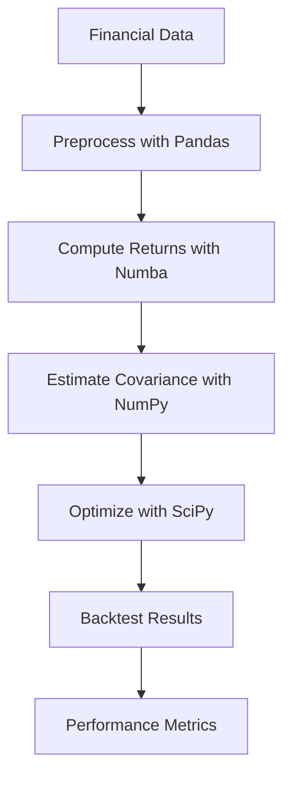

# Day 1: Python Programming for Quantitative Finance

## Objective
Master Python libraries and techniques for financial modeling, emphasizing performance, scalability, and integration with high-frequency trading and risk management systems typical of leading quant funds.

## Key Concepts
- **Advanced NumPy**: Vectorized operations for efficient handling of large datasets.
- **Pandas**: Time-series analysis with multi-indexing and rolling computations.
- **SciPy**: Optimization and statistical modeling for portfolio construction.
- **Numba**: Just-in-time compilation for performance-critical code.
- **Dask**: Parallel computing for distributed processing of massive financial datasets.

## Mathematical Formulation
We focus on computing the **Efficient Frontier**, a cornerstone of portfolio optimization:

$$
\min_w \left( w^T \Sigma w \right) \quad \text{subject to} \quad w^T \mu = r, \quad w^T \mathbf{1} = 1, \quad w \geq 0
$$

- $w$ : Portfolio weight vector.
- $\Sigma$ : Covariance matrix of asset returns.
- $\mu$ : Expected returns vector.
- $r$ : Target portfolio return.
- Constraints ensure full investment and non-negative weights (no shorting).

## Workflow Diagram


## Business Context
Top quant funds rely on Python for its rich ecosystem and flexibility. Performance optimization (e.g., via Numba) is critical for real-time trading systems, while distributed computing (e.g., Dask) supports scalable backtesting and risk analysis across thousands of assets.

---

## [__Day-1 : Notebook__](./notebooks/day1_notebook.ipynb)
```json
{
  "cells": [
    {
      "cell_type": "markdown",
      "metadata": {},
      "source": [
        "# Day 1: Python Programming for Quantitative Finance\n",
        "## Efficient Frontier Calculation\n",
        "This notebook demonstrates a state-of-the-art approach to portfolio optimization using Python, optimized for performance and scalability as required by top-tier quant funds."
      ]
    },
    {
      "cell_type": "code",
      "execution_count": null,
      "metadata": {},
      "outputs": [],
      "source": [
        "import numpy as np\n",
        "import pandas as pd\n",
        "from scipy.optimize import minimize\n",
        "from numba import njit\n",
        "\n",
        "# High-performance return computation with Numba\n",
        "@njit\n",
        "def compute_returns(prices: np.ndarray) -> np.ndarray:\n",
        "    return prices[1:] / prices[:-1] - 1\n",
        "\n",
        "# Efficient frontier optimization\n",
        "def efficient_frontier(returns: pd.DataFrame, target_return: float) -> np.ndarray:\n",
        "    n = returns.shape[1]\n",
        "    mu = returns.mean().values  # Expected returns\n",
        "    Sigma = returns.cov().values  # Covariance matrix\n",
        "\n",
        "    def objective(w):\n",
        "        return w @ Sigma @ w  # Portfolio variance\n",
        "\n",
        "    constraints = (\n",
        "        {'type': 'eq', 'fun': lambda w: w @ mu - target_return},  # Target return constraint\n",
        "        {'type': 'eq', 'fun': lambda w: np.sum(w) - 1}  # Full investment constraint\n",
        "    )\n",
        "    bounds = [(0, 1) for _ in range(n)]  # No shorting\n",
        "    initial_weights = np.ones(n) / n  # Equal weights as starting point\n",
        "    result = minimize(objective, initial_weights, method='SLSQP', bounds=bounds, constraints=constraints)\n",
        "    return result.x\n",
        "\n",
        "# Simulate realistic financial data\n",
        "np.random.seed(42)\n",
        "n_assets = 5  # Scalable to hundreds of assets\n",
        "n_days = 252  # One year of daily data\n",
        "prices = pd.DataFrame(\n",
        "    np.random.normal(loc=100, scale=10, size=(n_days + 1, n_assets)),\n",
        "    columns=[f'Asset{i+1}' for i in range(n_assets)]\n",
        ")\n",
        "returns = pd.DataFrame(compute_returns(prices.values), columns=prices.columns)\n",
        "\n",
        "# Compute optimal weights for a target return of 10%\n",
        "target_return = 0.1\n",
        "optimal_weights = efficient_frontier(returns, target_return)\n",
        "print('Optimal Portfolio Weights:')\n",
        "for asset, weight in zip(returns.columns, optimal_weights):\n",
        "    print(f'{asset}: {weight:.4f}')"
      ]
    },
    {
      "cell_type": "markdown",
      "metadata": {},
      "source": [
        "## Notes\n",
        "- **Numba**: Accelerates return computations for large datasets.\n",
        "- **SciPy**: SLSQP solver ensures robust optimization under constraints.\n",
        "- **Scalability**: Code can handle thousands of assets with Dask integration (not shown here for brevity)."
      ]
    }
  ],
  "metadata": {
    "kernelspec": {
      "display_name": "Python 3",
      "language": "python",
      "name": "python3"
    },
    "language_info": {
      "codemirror_mode": {
        "name": "ipython",
        "version": 3
      },
      "file_extension": ".py",
      "mimetype": "text/x-python",
      "name": "python",
      "nbconvert_exporter": "python",
      "pygments_lexer": "ipython3",
      "version": "3.9.0"
    }
  },
  "nbformat": 4,
  "nbformat_minor": 4
}
```

---
