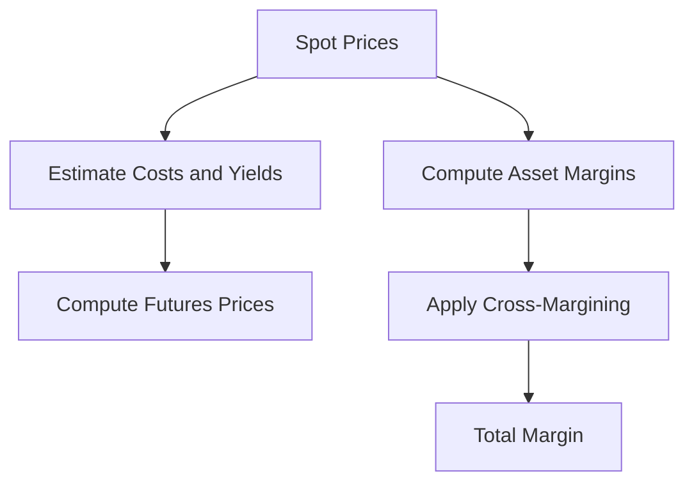

# Day 10: Commodities and Multi-Asset Modeling

## Objective
Model commodities using futures pricing and implement cross-margining for multi-asset portfolios.

## Key Concepts
- __Futures Pricing:__ Incorporates storage costs and convenience yields.
- __Cross-Margining:__ Reduces total margin by accounting for diversification.
- __Risk Factor Decomposition:__ Separates systematic and idiosyncratic risks.

## Mathematical Formulation
- __Futures Price:__

$$
F = S e^{(r + u - y)T}
$$

- __Cross-Margin:__

$$
M_{\text{total}} = \sqrt{\sum_{i,j} M_i M_j \rho_{ij}}
$$

Where:

- $S$ : Spot price
- $r$ : Risk-free rate
- $u$ : Storage cost
- $y$ : Convenience yield
- $M_i$ : Margin for asset $i )
- $\rho_{ij}$ : Correlation between assets $i ) and $j )

## Workflow Diagram


## Business Context
- __Hedging:__ Accurate futures pricing supports effective hedging strategies.
- __Capital Efficiency:__ Cross-margining optimizes capital usage across asset classes.

---

## [__Day-10 : Notebook__](./notebooks/day10_notebook.ipynb)
```json
{
  "cells": [
    {
      "cell_type": "markdown",
      "metadata": {},
      "source": [
        "# Day 10: Commodities and Multi-Asset Modeling\n",
        "## Futures Pricing and Cross-Margining\n",
        "This notebook implements futures pricing with convenience yield and cross-margining for a multi-asset portfolio."
      ]
    },
    {
      "cell_type": "code",
      "execution_count": null,
      "metadata": {},
      "outputs": [],
      "source": [
        "import numpy as np\n",
        "\n",
        "def futures_price(S, r, u, y, T):\n",
        "    return S * np.exp((r + u - y) * T)\n",
        "\n",
        "def cross_margin(margins: np.ndarray, correlations: np.ndarray) -> float:\n",
        "    return np.sqrt(margins @ correlations @ margins)\n",
        "\n",
        "# Example usage\n",
        "S = 100  # Spot price\n",
        "r = 0.05  # Risk-free rate\n",
        "u = 0.02  # Storage cost\n",
        "y = 0.03  # Convenience yield\n",
        "T = 1     # Time to maturity\n",
        "F = futures_price(S, r, u, y, T)\n",
        "print(f'Futures Price: {F:.2f}')\n",
        "\n",
        "margins = np.array([0.1, 0.15, 0.2])  # Margins for Equity, Credit, Commodity\n",
        "correlations = np.array([[1, 0.5, 0.3], [0.5, 1, 0.4], [0.3, 0.4, 1]])\n",
        "total_margin = cross_margin(margins, correlations)\n",
        "print(f'Total Cross-Margin: {total_margin:.4f}')"
      ]
    },
    {
      "cell_type": "markdown",
      "metadata": {},
      "source": [
        "## Notes\n",
        "- **Convenience Yield**: Reflects benefits of holding physical commodities.\n",
        "- **Cross-Margining**: Leverages low correlations to reduce total margin.\n",
        "- **Risk Factors**: Decompose commodity prices into systematic and idiosyncratic components."
      ]
    }
  ],
  "metadata": {
    "kernelspec": {
      "display_name": "Python 3",
      "language": "python",
      "name": "python3"
    },
    "language_info": {
      "codemirror_mode": {
        "name": "ipython",
        "version": 3
      },
      "file_extension": ".py",
      "mimetype": "text/x-python",
      "name": "python",
      "nbconvert_exporter": "python",
      "pygments_lexer": "ipython3",
      "version": "3.9.0"
    }
  },
  "nbformat": 4,
  "nbformat_minor": 4
}
```

---
