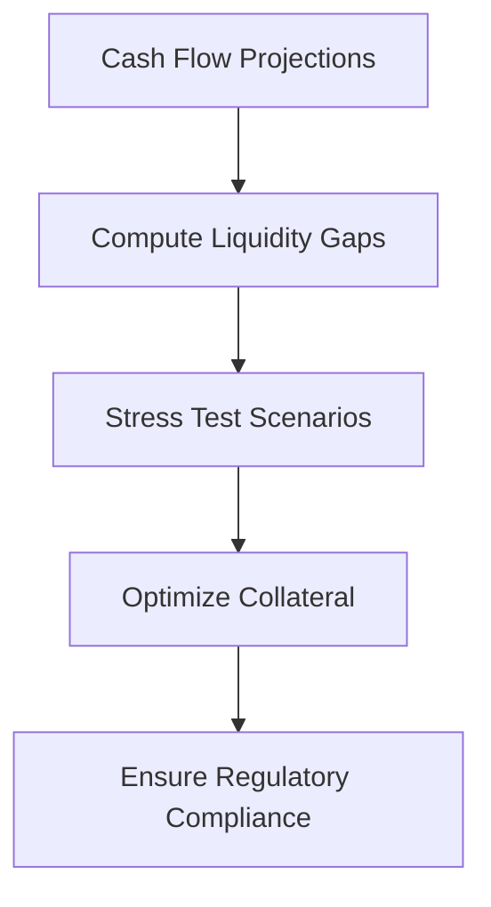

# Day 11: Liquidity and Collateral Frameworks

## Objective
Implement liquidity stress testing and collateral optimization under regulatory constraints.

## Key Concepts
- __Liquidity Gap Analysis:__ Assesses cash flow mismatches over time.
- __Collateral Transformation:__ Upgrades assets to meet HQLA requirements.
- __Regulatory Compliance:__ Automated checks for LCR and NSFR.

## Mathematical Formulation
- __Liquidity Gap:__

$$
G_t = \sum_{k=1}^t (I_k - O_k)
$$

- __Collateral Transformation:__

$$
\max_x \left$\sum_{i=1}^n v_i x_i \right) \quad \text{s.t.} \quad \sum_{i=1}^n c_i x_i \leq B
$$

Where:

- $I_k$ : Cash inflows at time $k )
- $O_k$ : Cash outflows at time $k )
- $x_i$ : Binary decision for asset $i )
- $v_i$ : Value of asset $i )
- $c_i$ : Cost of transformation
- $B$ : Budget

## Workflow Diagram


## Business Context
- __Resilience:__ Stress testing ensures survival under adverse conditions.
- __Efficiency:__ Collateral optimization minimizes costs while meeting requirements.

---

## [__Day-11 : Notebook__](./notebooks/day11_notebook.ipynb)
```json
{
  "cells": [
    {
      "cell_type": "markdown",
      "metadata": {},
      "source": [
        "# Day 11: Liquidity and Collateral Frameworks\n",
        "## Stress Testing and Collateral Optimization\n",
        "This notebook implements liquidity stress testing and collateral optimization under regulatory constraints."
      ]
    },
    {
      "cell_type": "code",
      "execution_count": null,
      "metadata": {},
      "outputs": [],
      "source": [
        "import numpy as np\n",
        "from mosek.fusion import *\n",
        "\n",
        "def liquidity_gap(cash_inflows: np.ndarray, cash_outflows: np.ndarray) -> np.ndarray:\n",
        "    return np.cumsum(cash_inflows - cash_outflows)\n",
        "\n",
        "def collateral_transformation(values: np.ndarray, costs: np.ndarray, budget: float) -> np.ndarray:\n",
        "    n = len(values)\n",
        "    with Model(\"CollateralTransform\") as M:\n",
        "        x = M.variable(\"x\", n, Domain.binary())\n",
        "        M.constraint(\"budget\", Expr.dot(costs, x), Domain.lessThan(budget))\n",
        "        M.objective(\"obj\", ObjectiveSense.Maximize, Expr.dot(values, x))\n",
        "        M.solve()\n",
        "        return x.level()\n",
        "\n",
        "# Example usage\n",
        "cash_inflows = np.array([100, 200, 150])\n",
        "cash_outflows = np.array([120, 180, 160])\n",
        "gaps = liquidity_gap(cash_inflows, cash_outflows)\n",
        "print(f'Liquidity Gaps: {gaps}')\n",
        "\n",
        "values = np.array([50, 60, 70])\n",
        "costs = np.array([10, 20, 30])\n",
        "budget = 40\n",
        "allocation = collateral_transformation(values, costs, budget)\n",
        "print(f'Collateral Transformation Allocation: {allocation}')"
      ]
    },
    {
      "cell_type": "markdown",
      "metadata": {},
      "source": [
        "## Notes\n",
        "- **Stress Testing**: Simulates adverse conditions to assess liquidity resilience.\n",
        "- **Collateral Transformation**: Upgrades assets to meet HQLA requirements.\n",
        "- **Regulatory Compliance**: Automated calculations ensure LCR and NSFR are met."
      ]
    }
  ],
  "metadata": {
    "kernelspec": {
      "display_name": "Python 3",
      "language": "python",
      "name": "python3"
    },
    "language_info": {
      "codemirror_mode": {
        "name": "ipython",
        "version": 3
      },
      "file_extension": ".py",
      "mimetype": "text/x-python",
      "name": "python",
      "nbconvert_exporter": "python",
      "pygments_lexer": "ipython3",
      "version": "3.9.0"
    }
  },
  "nbformat": 4,
  "nbformat_minor": 4
}
```

---
