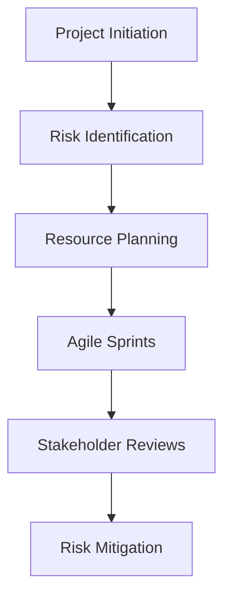

# Day 12: Project Management and Multi-Team Collaboration

## Objective
Develop advanced project management skills, focusing on Agile, risk management, and stakeholder engagement.

## Key Concepts
- __Agile Methodology:__ Iterative development with sprints and stand-ups.
- __Risk Register:__ Identifies, assesses, and mitigates project risks.
- __Resource Allocation:__ Optimizes team assignments for efficiency.

## Mathematical Formulation
Risk Score:

$$
R = P \cdot I
$$

Where:

- $P$ : Probability of risk occurrence
- $I$ : Impact of risk

## Workflow Diagram


## Business Context
- __Efficiency:__ Agile practices accelerate development and adaptation.
- __Risk Mitigation:__ Proactive management reduces project failures.
- __Collaboration:__ Engages all teams, ensuring alignment and success.

---

## [__Day-12 : Notebook__](./notebooks/day12_notebook.ipynb)
```json
{
  "cells": [
    {
      "cell_type": "markdown",
      "metadata": {},
      "source": [
        "# Day 12: Project Management and Multi-Team Collaboration\n",
        "## Advanced Agile and Risk Management\n",
        "This notebook outlines a sophisticated project management framework for quant projects."
      ]
    },
    {
      "cell_type": "markdown",
      "metadata": {},
      "source": [
        "## Risk Register\n",
        "| Risk              | Probability | Impact | Score | Mitigation          |\n",
        "|-------------------|-------------|--------|-------|---------------------|\n",
        "| Data Delay        | 0.3         | High   | 0.3H  | Backup data sources |\n",
        "| Model Overfitting | 0.2         | Medium | 0.2M  | Cross-validation    |\n",
        "| Regulatory Change | 0.1         | High   | 0.1H  | Modular design      |\n",
        "\n",
        "## Resource Allocation\n",
        "- **Quant Team**: 3 FTEs, focus on model development.\n",
        "- **IT Team**: 2 FTEs, focus on data pipelines.\n",
        "- **Risk Team**: 1 FTE, focus on validation.\n",
        "\n",
        "## Communication Plan\n",
        "- **Daily Stand-ups**: Quant and IT teams.\n",
        "- **Weekly Reviews**: All stakeholders.\n",
        "- **Monthly Reports**: Executive summary for leadership."
      ]
    },
    {
      "cell_type": "markdown",
      "metadata": {},
      "source": [
        "## Notes\n",
        "- **Agile**: Enables iterative development and quick pivots.\n",
        "- **Risk Management**: Proactive identification and mitigation.\n",
        "- **Stakeholder Engagement**: Ensures alignment and buy-in."
      ]
    }
  ],
  "metadata": {
    "kernelspec": {
      "display_name": "Python 3",
      "language": "python",
      "name": "python3"
    },
    "language_info": {
      "codemirror_mode": {
        "name": "ipython",
        "version": 3
      },
      "file_extension": ".py",
      "mimetype": "text/x-python",
      "name": "python",
      "nbconvert_exporter": "python",
      "pygments_lexer": "ipython3",
      "version": "3.9.0"
    }
  },
  "nbformat": 4,
  "nbformat_minor": 4
}
```

---
