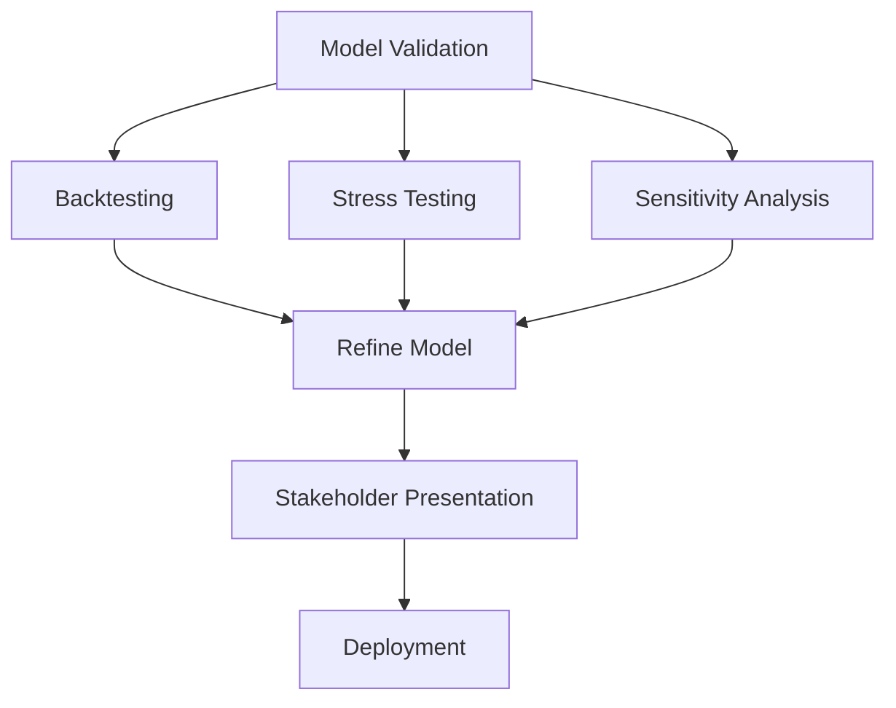

# Day 14: Final Preparation

## Objective
Validate the capstone model, prepare stakeholder presentations, and ensure deployment readiness.

## Key Concepts
- __Model Validation:__ Backtesting, stress testing, and sensitivity analysis.
- __Stakeholder Communication:__ Tailored presentations for executives, risk managers, and IT.
- __Deployment:__ CI/CD pipelines, monitoring, and maintenance plans.

## Mathematical Formulation
Sensitivity Analysis:

$$
\frac{\partial M}{\partial x_i}
$$

Where:

- $M$ : Total margin
- $x_i$ : Input parameter (e.g., volatility)

## Workflow Diagram


## Business Context
- __Reliability:__ Validation ensures the model performs under various conditions.
- __Adoption:__ Clear communication drives stakeholder confidence and usage.
- __Sustainability:__ Deployment plans ensure long-term model maintenance.

---

## [__Day-14 : Notebook__](./notebooks/day14_notebook.ipynb)
```json
{
  "cells": [
    {
      "cell_type": "markdown",
      "metadata": {},
      "source": [
        "# Day 14: Final Preparation\n",
        "## Model Validation and Stakeholder Presentation\n",
        "This notebook outlines the final steps for preparing a quant model for production."
      ]
    },
    {
      "cell_type": "markdown",
      "metadata": {},
      "source": [
        "## Validation Checklist\n",
        "- **Backtesting**: Sharpe Ratio > 1.5.\n",
        "- **Stress Testing**: Performance under 2008 crisis scenarios.\n",
        "- **Sensitivity Analysis**: Impact of ±10% volatility changes.\n",
        "\n",
        "## Stakeholder Presentation\n",
        "- **Executive Summary**: Business impact, key metrics.\n",
        "- **Technical Deep Dive**: Model architecture, validation results.\n",
        "- **Demo**: Live model run with sample data.\n",
        "\n",
        "## Deployment Readiness\n",
        "- **IT**: Code reviewed, integrated with data pipelines.\n",
        "- **Risk**: Compliance with VaR limits, stress tests passed.\n",
        "- **Compliance**: Documentation for regulators prepared."
      ]
    },
    {
      "cell_type": "markdown",
      "metadata": {},
      "source": [
        "## Notes\n",
        "- **Validation**: Ensures model robustness and reliability.\n",
        "- **Communication**: Tailored to audience for maximum impact.\n",
        "- **Deployment**: Coordinated across teams for smooth rollout."
      ]
    }
  ],
  "metadata": {
    "kernelspec": {
      "display_name": "Python 3",
      "language": "python",
      "name": "python3"
    },
    "language_info": {
      "codemirror_mode": {
        "name": "ipython",
        "version": 3
      },
      "file_extension": ".py",
      "mimetype": "text/x-python",
      "name": "python",
      "nbconvert_exporter": "python",
      "pygments_lexer": "ipython3",
      "version": "3.9.0"
    }
  },
  "nbformat": 4,
  "nbformat_minor": 4
}
```

---
