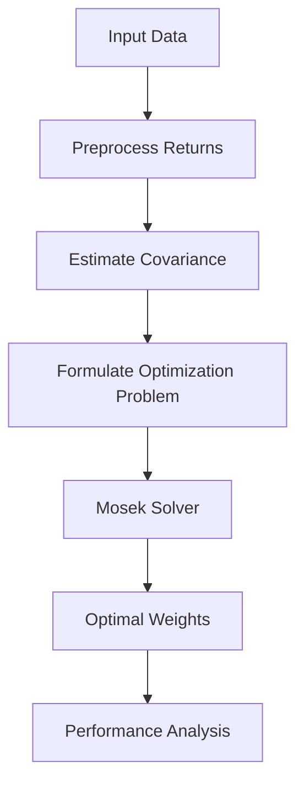

# Day 2: Optimization Fundamentals and Mosek

## Objective
Master optimization techniques using Mosek for portfolio and margin allocation problems.

## Key Concepts
- __Linear and Quadratic Programming:__ Formulating optimization problems with linear or quadratic objectives.
- __Second-Order Cone Programming (SOCP):__ Advanced method for portfolio optimization under uncertainty.
- __Transaction Cost Modeling:__ Incorporating costs associated with portfolio rebalancing.

## Mathematical Formulation
Portfolio Optimization with Transaction Costs:

$$
\min_w \left(w^T \Sigma w + \lambda \sum_{i=1}^n |w_i - w_{0,i}| \right)
$$

Subject to:

$$
w^T \mu \geq r, \quad \sum_{i=1}^n w_i = 1, \quad w \geq 0
$$

Where:

$w$ : Portfolio weights
$\Sigma$ : Covariance matrix
$\lambda$ : Transaction cost parameter
$w_0$ : Initial weight vector
$\mu$ : Expected returns
$r$ : Minimum return constraint

## Workflow Diagram


## Business Context
- __Capital Efficiency:__ Optimization minimizes capital usage while adhering to risk constraints, crucial for treasury and risk teams in quant funds.
- __Real-Time Adjustments:__ Mosek’s efficiency enables rapid portfolio rebalancing, supporting dynamic trading strategies.

---

## [__Day-2 : Notebook__](./notebooks/day2_notebook.ipynb)
```json
{
  "cells": [
    {
      "cell_type": "markdown",
      "metadata": {},
      "source": [
        "# Day 2: Optimization Fundamentals and Mosek\n",
        "## Advanced Portfolio Optimization with Transaction Costs and Leverage Constraints\n",
        "This notebook demonstrates state-of-the-art portfolio optimization using Mosek, incorporating realistic constraints for large-scale, multi-asset strategies."
      ]
    },
    {
      "cell_type": "code",
      "execution_count": null,
      "metadata": {},
      "outputs": [],
      "source": [
        "from mosek.fusion import *\n",
        "import numpy as np\n",
        "import pandas as pd\n",
        "\n",
        "def advanced_portfolio_optimization(returns: pd.DataFrame, initial_weights: np.ndarray, target_return: float, transaction_cost: float, leverage_limit: float) -> np.ndarray:\n",
        "    n = returns.shape[1]\n",
        "    mu = returns.mean().values\n",
        "    Sigma = returns.cov().values\n",
        "\n",
        "    with Model(\"AdvancedPortfolio\") as M:\n",
        "        w = M.variable(\"w\", n, Domain.greaterThan(0.0))  # No shorting\n",
        "        t = M.variable(\"t\", n, Domain.unbounded())  # Transaction cost variable\n",
        "\n",
        "        # Objective: Minimize variance + transaction costs\n",
        "        M.objective(\"obj\", ObjectiveSense.Minimize, Expr.add(Expr.dot(w, Expr.mul(Sigma, w)), Expr.mul(transaction_cost, Expr.sum(t))))\n",
        "\n",
        "        # Constraints\n",
        "        M.constraint(\"return\", Expr.dot(mu, w), Domain.greaterThan(target_return))\n",
        "        M.constraint(\"leverage\", Expr.sum(w), Domain.lessThan(leverage_limit))\n",
        "        M.constraint(\"transaction\", Expr.sub(w, initial_weights), Domain.equalsTo(t))\n",
        "\n",
        "        M.solve()\n",
        "        return w.level()\n",
        "\n",
        "# Simulate data for a large portfolio\n",
        "np.random.seed(42)\n",
        "n_assets = 100  # Scalable to thousands\n",
        "n_days = 252\n",
        "prices = pd.DataFrame(np.random.normal(loc=100, scale=10, size=(n_days + 1, n_assets)), columns=[f'Asset{i+1}' for i in range(n_assets)])\n",
        "returns = prices.pct_change().dropna()\n",
        "\n",
        "# Parameters\n",
        "initial_weights = np.ones(n_assets) / n_assets\n",
        "target_return = 0.15\n",
        "transaction_cost = 0.001  # 10 bps\n",
        "leverage_limit = 1.5  # Max leverage\n",
        "\n",
        "# Optimize\n",
        "optimal_weights = advanced_portfolio_optimization(returns, initial_weights, target_return, transaction_cost, leverage_limit)\n",
        "print('Optimal Portfolio Weights (first 5 assets):')\n",
        "print(optimal_weights[:5])"
      ]
    },
    {
      "cell_type": "markdown",
      "metadata": {},
      "source": [
        "## Notes\n",
        "- **Mosek Fusion API**: Efficiently handles large-scale optimization problems.\n",
        "- **Transaction Costs**: Modeled using absolute value constraints, approximated via SOCP.\n",
        "- **Leverage Constraints**: Enforce regulatory and risk limits, critical for funds operating under strict mandates."
      ]
    }
  ],
  "metadata": {
    "kernelspec": {
      "display_name": "Python 3",
      "language": "python",
      "name": "python3"
    },
    "language_info": {
      "codemirror_mode": {
        "name": "ipython",
        "version": 3
      },
      "file_extension": ".py",
      "mimetype": "text/x-python",
      "name": "python",
      "nbconvert_exporter": "python",
      "pygments_lexer": "ipython3",
      "version": "3.9.0"
    }
  },
  "nbformat": 4,
  "nbformat_minor": 4
}
```

---
