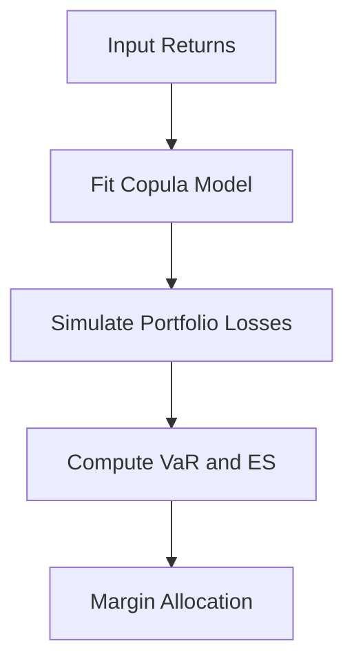

# Day 3: Risk-Based Margin Models

## Objective
Develop advanced margin models using copulas to capture dependencies and compute VaR and ES for multi-asset portfolios.

## Key Concepts
- __Value at Risk (VaR):__ Measures the potential loss over a given time horizon at a specified confidence level.
- __Expected Shortfall (ES):__ Provides the average loss beyond the VaR threshold, offering a more comprehensive risk measure.
- __Copula Models:__ Capture non-linear dependencies between asset returns, essential for accurate tail risk assessment.

## Mathematical Formulation
Copula-based VaR and ES:

$$
text{VaR}\alpha = F^{-1}(1 - \alpha), \quad \text{ES}\alpha = \frac{1}{\alpha} \int_0^\alpha F^{-1}(u) , du
$$

Where:

- $F^{-1}$ : Inverse cumulative distribution function of portfolio losses.
- $\alpha$ : Confidence level (e.g., 0.05 for 95% VaR).

## Workflow Diagram


## Business Context
- __Tail Risk Management:__ Copulas provide a robust framework for modeling extreme market events, crucial for funds managing large, diversified portfolios.
- __Regulatory Compliance:__ VaR and ES are key metrics for meeting regulatory capital requirements (e.g., Basel III).

---

## [__Day-3 : Notebook__](./notebooks/day3_notebook.ipynb)
```json
{
  "cells": [
    {
      "cell_type": "markdown",
      "metadata": {},
      "source": [
        "# Day 3: Risk-Based Margin Models\n",
        "## Copula-Based VaR and ES for Multi-Asset Portfolios\n",
        "This notebook implements a sophisticated margin model using copulas to capture dependencies and compute VaR and ES for a multi-asset portfolio."
      ]
    },
    {
      "cell_type": "code",
      "execution_count": null,
      "metadata": {},
      "outputs": [],
      "source": [
        "import numpy as np\n",
        "import pandas as pd\n",
        "from scipy.stats import norm, t\n",
        "from copulas.multivariate import GaussianCopula\n",
        "\n",
        "def copula_var_es(returns: pd.DataFrame, alpha: float = 0.05, n_sim: int = 10000) -> tuple:\n",
        "    copula = GaussianCopula()\n",
        "    copula.fit(returns)\n",
        "    simulated = copula.sample(n_sim)\n",
        "    portfolio_losses = simulated.sum(axis=1)\n",
        "    var = np.percentile(portfolio_losses, 100 * (1 - alpha))\n",
        "    es = portfolio_losses[portfolio_losses > var].mean()\n",
        "    return var, es\n",
        "\n",
        "# Simulate correlated returns\n",
        "np.random.seed(42)\n",
        "n_assets = 5\n",
        "n_days = 252\n",
        "corr_matrix = np.array([[1, 0.8, 0.6, 0.4, 0.2],\n",
        "                        [0.8, 1, 0.7, 0.5, 0.3],\n",
        "                        [0.6, 0.7, 1, 0.6, 0.4],\n",
        "                        [0.4, 0.5, 0.6, 1, 0.5],\n",
        "                        [0.2, 0.3, 0.4, 0.5, 1]])\n",
        "returns = pd.DataFrame(np.random.multivariate_normal(np.zeros(n_assets), corr_matrix, n_days))\n",
        "\n",
        "# Compute VaR and ES\n",
        "var, es = copula_var_es(returns)\n",
        "print(f'VaR (95%): {var:.4f}, ES (95%): {es:.4f}')"
      ]
    },
    {
      "cell_type": "markdown",
      "metadata": {},
      "source": [
        "## Notes\n",
        "- **Copula Models**: Capture non-linear dependencies, crucial for tail risk.\n",
        "- **Monte Carlo Simulation**: Enables stress testing under various scenarios.\n",
        "- **Portfolio Margining**: Reduces capital requirements by accounting for diversification."
      ]
    }
  ],
  "metadata": {
    "kernelspec": {
      "display_name": "Python 3",
      "language": "python",
      "name": "python3"
    },
    "language_info": {
      "codemirror_mode": {
        "name": "ipython",
        "version": 3
      },
      "file_extension": ".py",
      "mimetype": "text/x-python",
      "name": "python",
      "nbconvert_exporter": "python",
      "pygments_lexer": "ipython3",
      "version": "3.9.0"
    }
  },
  "nbformat": 4,
  "nbformat_minor": 4
}
```

---
