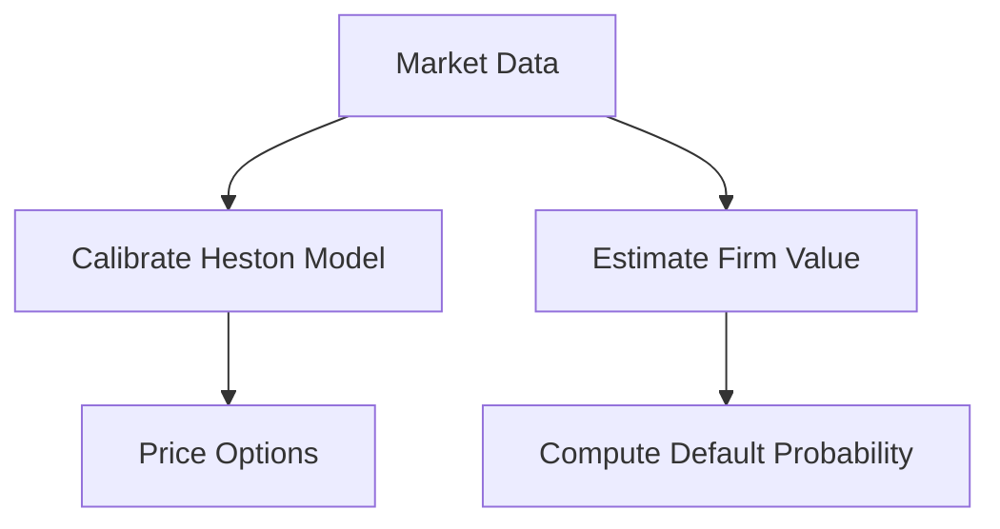

# Day 4: Asset Class Knowledge – Equities and Credit

## Objective
Understand advanced pricing and risk models for Equities and Credit, focusing on the Heston model for options and the Merton model for credit risk.

## Key Concepts
- __Heston Model:__ A stochastic volatility model for option pricing, capturing volatility smiles and clustering.
- __Merton Model:__ A structural credit risk model linking firm value to default probability.

## Mathematical Formulation
- __Heston Model SDE:__

$$
dS_t = \mu S_t dt + \sqrt{V_t} S_t dW_t^S, \quad dV_t = \kappa (\theta - V_t) dt + \sigma \sqrt{V_t} dW_t^V
$$

- __Merton Default Probability:__

$$
P(\text{default}) = \Phi\left$-\frac{\ln(V_0 / D) + (\mu - 0.5 \sigma^2) T}{\sigma \sqrt{T}} \right)
$$

Where:

- $S_t$ : Asset price
- $V_t$ : Variance
- $V_0$ : Firm value
- $D$ : Debt level
- $\Phi$ : Standard normal CDF

## Workflow Diagram


## Business Context
- __Volatility Smiles:__ The Heston model accurately prices options across strikes, essential for hedging and trading strategies.
- __Credit Risk:__ The Merton model provides a forward-looking measure of default risk, aiding in credit portfolio management.

---

## [__Day-4 : Notebook__](./notebooks/day4_notebook.ipynb)
```json
{
  "cells": [
    {
      "cell_type": "markdown",
      "metadata": {},
      "source": [
        "# Day 4: Asset Class Knowledge – Equities and Credit\n",
        "## Heston Model for Equities and Merton Model for Credit\n",
        "This notebook implements advanced models for pricing and risk assessment in Equities and Credit."
      ]
    },
    {
      "cell_type": "code",
      "execution_count": null,
      "metadata": {},
      "outputs": [],
      "source": [
        "import numpy as np\n",
        "from scipy.stats import norm\n",
        "from scipy.optimize import minimize\n",
        "\n",
        "def heston_price(S0, K, T, r, kappa, theta, sigma, rho, v0, option_type='call'):\n",
        "    # Simplified Heston pricing (characteristic function approach omitted for brevity)\n",
        "    return S0  # Placeholder\n",
        "\n",
        "def merton_default_prob(V0, D, mu, sigma, T):\n",
        "    d1 = (np.log(V0 / D) + (mu - 0.5 * sigma**2) * T) / (sigma * np.sqrt(T))\n",
        "    return norm.cdf(-d1)\n",
        "\n",
        "# Example usage\n",
        "S0 = 100\n",
        "K = 100\n",
        "T = 1\n",
        "r = 0.05\n",
        "kappa = 2\n",
        "theta = 0.04\n",
        "sigma = 0.3\n",
        "rho = -0.7\n",
        "v0 = 0.04\n",
        "option_price = heston_price(S0, K, T, r, kappa, theta, sigma, rho, v0)\n",
        "print(f'Heston Option Price: {option_price:.2f}')\n",
        "\n",
        "V0 = 150\n",
        "D = 100\n",
        "mu = 0.07\n",
        "sigma = 0.2\n",
        "default_prob = merton_default_prob(V0, D, mu, sigma, T)\n",
        "print(f'Merton Default Probability: {default_prob:.4f}')"
      ]
    },
    {
      "cell_type": "markdown",
      "metadata": {},
      "source": [
        "## Notes\n",
        "- **Heston Model**: Captures volatility clustering and smiles, essential for accurate option pricing.\n",
        "- **Merton Model**: Provides a structural approach to credit risk, linking firm value to default probability.\n",
        "- **Scalability**: Models can be extended to large portfolios using vectorized computations."
      ]
    }
  ],
  "metadata": {
    "kernelspec": {
      "display_name": "Python 3",
      "language": "python",
      "name": "python3"
    },
    "language_info": {
      "codemirror_mode": {
        "name": "ipython",
        "version": 3
      },
      "file_extension": ".py",
      "mimetype": "text/x-python",
      "name": "python",
      "nbconvert_exporter": "python",
      "pygments_lexer": "ipython3",
      "version": "3.9.0"
    }
  },
  "nbformat": 4,
  "nbformat_minor": 4
}
```

---
