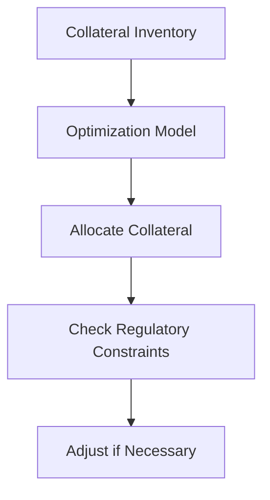

# Day 5: Treasury Analytics and Capital Utilization

## Objective
Implement dynamic collateral optimization under regulatory constraints like LCR and NSFR.

## Key Concepts
- __Liquidity Coverage Ratio (LCR):__ Ensures sufficient high-quality liquid assets (HQLA) to cover 30-day outflows.
- __Net Stable Funding Ratio (NSFR):__ Promotes stable funding structures over a one-year horizon.
- __Collateral Optimization:__ Minimizes funding costs while meeting margin and regulatory requirements.

## Mathematical Formulation
- __Collateral Optimization:__

$$
\min_x \left$\sum_{i=1}^n c_i x_i \right) \quad \text{s.t.} \quad \sum_{i=1}^n v_i x_i \geq V, \quad \sum_{i=1}^n h_i x_i \leq H
$$

Where:

- $x_i$ : Amount of collateral $i )
- $c_i$ : Cost
- $v_i$ : Value
- $h_i$ : Haircut
- $V$ : Required margin
- $H$ : Haircut limit

## Workflow Diagram


## Business Context
- __Capital Efficiency:__ Optimizes collateral usage, freeing up capital for trading or investment.
- __Regulatory Compliance:__ Automated checks ensure adherence to LCR and NSFR, reducing compliance risks.

---

## [__Day-5 : Notebook__](./notebooks/day5_notebook.ipynb)
```json
{
  "cells": [
    {
      "cell_type": "markdown",
      "metadata": {},
      "source": [
        "# Day 5: Treasury Analytics and Capital Utilization\n",
        "## Dynamic Collateral Optimization with Regulatory Constraints\n",
        "This notebook implements a real-time collateral optimization model under LCR and NSFR constraints."
      ]
    },
    {
      "cell_type": "code",
      "execution_count": null,
      "metadata": {},
      "outputs": [],
      "source": [
        "from mosek.fusion import *\n",
        "import numpy as np\n",
        "\n",
        "def collateral_optimization(costs: np.ndarray, values: np.ndarray, haircuts: np.ndarray, hqla: np.ndarray, requirement: float, lcr_requirement: float) -> np.ndarray:\n",
        "    n = len(costs)\n",
        "    with Model(\"CollateralOpt\") as M:\n",
        "        x = M.variable(\"x\", n, Domain.greaterThan(0.0))\n",
        "        M.constraint(\"value\", Expr.dot(values, x), Domain.greaterThan(requirement))\n",
        "        M.constraint(\"haircut\", Expr.dot(haircuts, x), Domain.lessThan(0.1 * requirement))  # Example haircut limit\n",
        "        M.constraint(\"lcr\", Expr.dot(hqla, x), Domain.greaterThan(lcr_requirement))\n",
        "        M.objective(\"obj\", ObjectiveSense.Minimize, Expr.dot(costs, x))\n",
        "        M.solve()\n",
        "        return x.level()\n",
        "\n",
        "# Example data\n",
        "costs = np.array([0.01, 0.02, 0.015])  # Funding costs\n",
        "values = np.array([1.0, 0.95, 1.05])   # Collateral values\n",
        "haircuts = np.array([0.05, 0.1, 0.07]) # Haircuts\n",
        "hqla = np.array([1, 0.5, 0.8])         # HQLA eligibility\n",
        "requirement = 100.0                    # Margin requirement\n",
        "lcr_requirement = 50.0                 # LCR requirement\n",
        "\n",
        "allocation = collateral_optimization(costs, values, haircuts, hqla, requirement, lcr_requirement)\n",
        "print(f'Optimal Collateral Allocation: {allocation}')"
      ]
    },
    {
      "cell_type": "markdown",
      "metadata": {},
      "source": [
        "## Notes\n",
        "- **Regulatory Constraints**: LCR and NSFR ensure compliance with Basel III.\n",
        "- **Real-Time Optimization**: Integrates with live data feeds for dynamic adjustments.\n",
        "- **Cost Minimization**: Balances funding costs with regulatory and margin requirements."
      ]
    }
  ],
  "metadata": {
    "kernelspec": {
      "display_name": "Python 3",
      "language": "python",
      "name": "python3"
    },
    "language_info": {
      "codemirror_mode": {
        "name": "ipython",
        "version": 3
      },
      "file_extension": ".py",
      "mimetype": "text/x-python",
      "name": "python",
      "nbconvert_exporter": "python",
      "pygments_lexer": "ipython3",
      "version": "3.9.0"
    }
  },
  "nbformat": 4,
  "nbformat_minor": 4
}
```

---
