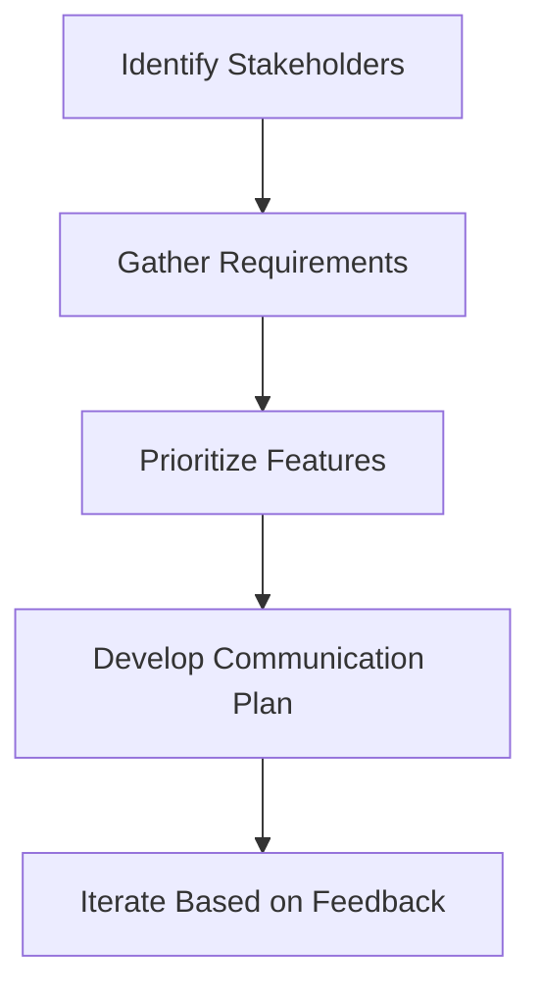

# Day 6: Collaboration and Business Context

## Objective
Develop advanced stakeholder management and requirements engineering skills for quant model development.

## Key Concepts
- __User Stories:__ Capture stakeholder needs in a structured format.
- __Prioritization Matrix:__ Balance business value, risk mitigation, and effort.
- __Communication Plans:__ Tailor messaging to different stakeholder groups.

## Mathematical Formulation
- __Expected Value for Prioritization:__

$$
EV = \sum_{i} p_i v_i
$$4

Where:

- $p_i$ : Probability of success for feature $i )
- $v_i$ : Business value of feature $i )

## Workflow Diagram


## Business Context
- __Alignment:__ Ensures quant models meet business needs and regulatory requirements.
- __Efficiency:__ Prioritization focuses resources on high-impact features.
- __Adoption:__ Clear communication increases stakeholder buy-in and model usage.

---

## [__Day-6 : Notebook__](./notebooks/day6_notebook.ipynb)
```json
{
  "cells": [
    {
      "cell_type": "markdown",
      "metadata": {},
      "source": [
        "# Day 6: Collaboration and Business Context\n",
        "## Advanced Stakeholder Management and Requirements Engineering\n",
        "This notebook outlines a sophisticated approach to managing stakeholders and engineering requirements for quant model development."
      ]
    },
    {
      "cell_type": "markdown",
      "metadata": {},
      "source": [
        "## User Story Template\n",
        "- **As a** [stakeholder], **I need** [feature], **so that** [benefit].\n",
        "\n",
        "## Example User Stories\n",
        "- **As a Portfolio Manager**, I need real-time margin calculations, so that I can adjust positions quickly.\n",
        "- **As a Risk Manager**, I need VaR and ES reports, so that I can ensure compliance.\n",
        "- **As an IT Developer**, I need modular code, so that I can integrate it easily.\n",
        "\n",
        "## Prioritization Matrix\n",
        "| Feature           | Business Value | Risk Mitigation | Effort | Priority |\n",
        "|-------------------|----------------|-----------------|--------|----------|\n",
        "| Real-time margins | High           | Medium          | High   | 2.0      |\n",
        "| VaR reports       | Medium         | High            | Medium | 1.5      |\n",
        "| Modular code      | Low            | Low             | Low    | 1.0      |\n",
        "\n",
        "## Communication Plan\n",
        "- **Portfolio Managers**: Weekly demos, focus on usability.\n",
        "- **Risk Managers**: Bi-weekly risk reports, focus on compliance.\n",
        "- **IT Developers**: Daily stand-ups, focus on technical integration."
      ]
    },
    {
      "cell_type": "markdown",
      "metadata": {},
      "source": [
        "## Notes\n",
        "- **Agile Practices**: Enable rapid iteration and feedback.\n",
        "- **Stakeholder Analysis**: Ensures all needs are addressed.\n",
        "- **Communication**: Tailored to each stakeholder group for maximum impact."
      ]
    }
  ],
  "metadata": {
    "kernelspec": {
      "display_name": "Python 3",
      "language": "python",
      "name": "python3"
    },
    "language_info": {
      "codemirror_mode": {
        "name": "ipython",
        "version": 3
      },
      "file_extension": ".py",
      "mimetype": "text/x-python",
      "name": "python",
      "nbconvert_exporter": "python",
      "pygments_lexer": "ipython3",
      "version": "3.9.0"
    }
  },
  "nbformat": 4,
  "nbformat_minor": 4
}
```

---

