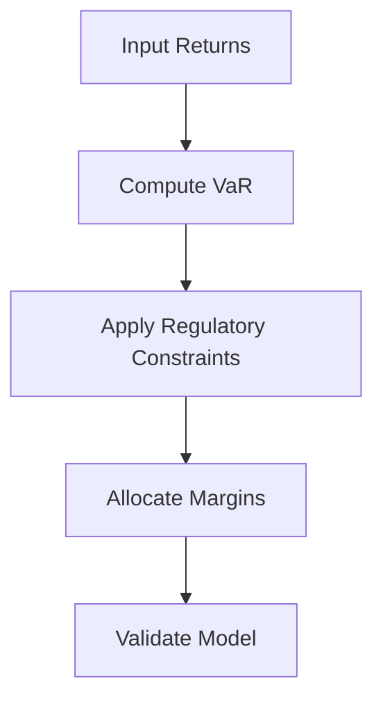

# Day 7: Review and Mini-Project

## Objective
Integrate concepts from Days 1-6 to build a margin allocation model for a multi-asset portfolio.

## Key Concepts
- __VaR Calculation:__ Estimate potential losses using historical simulation.
- __Margin Allocation:__ Combine VaR with regulatory requirements to set margins.
- __Model Validation:__ Ensure accuracy through backtesting and sensitivity analysis.

## Mathematical Formulation
Margin Calculation:

$$
M = \max \left$M_{\text{reg}}, k \cdot \text{VaR}_\alpha \right)
$$

Where:

- $M_{\text{reg}}$ : Regulatory minimum margin
- $k$ : Scaling factor
- $\text{VaR}_\alpha$ : Value at Risk at confidence level $\alpha )

## Workflow Diagram


## Business Context
- __Capital Efficiency:__ Balances risk and capital usage, optimizing portfolio performance.
- __Compliance:__ Ensures adherence to regulatory standards, reducing legal risks.

---

## [__Day-7 : Notebook__](./notebooks/day7_notebook.ipynb)
```json
{
  "cells": [
    {
      "cell_type": "markdown",
      "metadata": {},
      "source": [
        "# Day 7: Review and Mini-Project\n",
        "## Integrated Multi-Asset Margin Model\n",
        "This notebook integrates concepts from Days 1-6 to build a margin model for a multi-asset portfolio."
      ]
    },
    {
      "cell_type": "code",
      "execution_count": null,
      "metadata": {},
      "outputs": [],
      "source": [
        "import numpy as np\n",
        "import pandas as pd\n",
        "from scipy.stats import norm\n",
        "\n",
        "def compute_var(returns: pd.DataFrame, alpha: float = 0.05) -> float:\n",
        "    portfolio_returns = returns.sum(axis=1)\n",
        "    return np.percentile(portfolio_returns, 100 * alpha)\n",
        "\n",
        "def margin_model(returns: pd.DataFrame, regulatory_margin: float, var_alpha: float = 0.05, scaling_factor: float = 1.0) -> float:\n",
        "    var = compute_var(returns, var_alpha)\n",
        "    margin = max(regulatory_margin, scaling_factor * var)\n",
        "    return margin\n",
        "\n",
        "# Simulate returns\n",
        "np.random.seed(42)\n",
        "returns = pd.DataFrame(np.random.normal(0, 0.01, (252, 3)), columns=['Equity', 'Credit', 'Commodity'])\n",
        "\n",
        "# Compute margin\n",
        "regulatory_margin = 0.25\n",
        "margin = margin_model(returns, regulatory_margin)\n",
        "print(f'Portfolio Margin: {margin:.4f}')"
      ]
    },
    {
      "cell_type": "markdown",
      "metadata": {},
      "source": [
        "## Documentation\n",
        "- **Technical**: Model methodology, code structure, validation tests.\n",
        "- **Business**: Margin impact analysis, compliance report.\n",
        "\n",
        "## Testing\n",
        "- **Unit Tests**: Verify VaR calculation, margin logic.\n",
        "- **Validation**: Compare with historical margins, ensure consistency."
      ]
    }
  ],
  "metadata": {
    "kernelspec": {
      "display_name": "Python 3",
      "language": "python",
      "name": "python3"
    },
    "language_info": {
      "codemirror_mode": {
        "name": "ipython",
        "version": 3
      },
      "file_extension": ".py",
      "mimetype": "text/x-python",
      "name": "python",
      "nbconvert_exporter": "python",
      "pygments_lexer": "ipython3",
      "version": "3.9.0"
    }
  },
  "nbformat": 4,
  "nbformat_minor": 4
}
```

---
