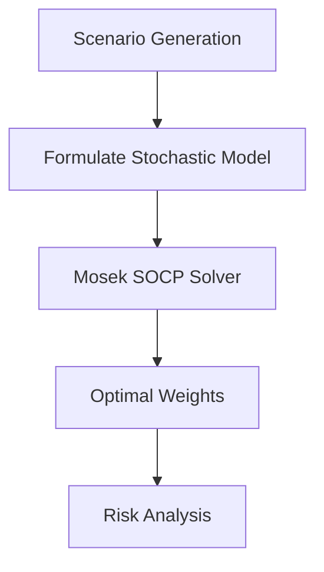

# Day 8: Advanced Optimization with Mosek

## Objective
Master stochastic optimization and SOCP for robust portfolio construction under uncertainty.

## Key Concepts
- __Stochastic Programming:__ Optimizes decisions across multiple scenarios.
- __Second-Order Cone Programming (SOCP):__ Efficiently handles non-linear constraints like variance.
- __Transaction Cost Modeling:__ Incorporates costs to reflect real-world trading conditions.

## Mathematical Formulation

Stochastic Portfolio Optimization:

$$
\min_w \left$\sum_{s=1}^S p_s w^T \Sigma_s w \right) \quad \text{s.t.} \quad w^T \mu_s \geq r \quad \forall s
$$

Where:

- $p_s$ : Probability of scenario $s )
- $\Sigma_s$ : Covariance matrix for scenario $s )
- $\mu_s$ : Expected returns for scenario $s )

## Workflow Diagram


## Business Context
- __Robustness:__ Ensures portfolio performance across various market conditions.
- __Scalability:__ Handles large portfolios with thousands of assets efficiently.

---

## [__Day-8 : Notebook__](./notebooks/day8_notebook.ipynb)
```json
{
  "cells": [
    {
      "cell_type": "markdown",
      "metadata": {},
      "source": [
        "# Day 8: Advanced Optimization with Mosek\n",
        "## Stochastic Portfolio Optimization with SOCP\n",
        "This notebook implements a stochastic optimization model using Mosek's SOCP capabilities for robust portfolio construction."
      ]
    },
    {
      "cell_type": "code",
      "execution_count": null,
      "metadata": {},
      "outputs": [],
      "source": [
        "from mosek.fusion import *\n",
        "import numpy as np\n",
        "\n",
        "def stochastic_optimization(returns_scenarios: list, probabilities: np.ndarray, target_return: float) -> np.ndarray:\n",
        "    n = returns_scenarios[0].shape[1]\n",
        "    with Model(\"StochasticOpt\") as M:\n",
        "        w = M.variable(\"w\", n, Domain.unbounded())\n",
        "        t = M.variable(\"t\", 1, Domain.unbounded())\n",
        "\n",
        "        # Objective: Minimize weighted sum of scenario variances\n",
        "        obj = Expr.add([prob * Expr.dot(w, Expr.mul(Sigma, w)) for prob, Sigma in zip(probabilities, [np.cov(scenario.T) for scenario in returns_scenarios])])\n",
        "        M.objective(\"obj\", ObjectiveSense.Minimize, obj)\n",
        "\n",
        "        # Constraints: Target return per scenario\n",
        "        for scenario in returns_scenarios:\n",
        "            M.constraint(Expr.dot(scenario.mean(axis=0), w), Domain.greaterThan(target_return))\n",
        "\n",
        "        M.solve()\n",
        "        return w.level()\n",
        "\n",
        "# Example usage\n",
        "np.random.seed(42)\n",
        "scenarios = [pd.DataFrame(np.random.normal(0, 0.01, (100, 3))), pd.DataFrame(np.random.normal(0, 0.02, (100, 3)))]\n",
        "probabilities = np.array([0.7, 0.3])\n",
        "target_return = 0.05\n",
        "optimal_weights = stochastic_optimization(scenarios, probabilities, target_return)\n",
        "print(f'Optimal Weights: {optimal_weights}')"
      ]
    },
    {
      "cell_type": "markdown",
      "metadata": {},
      "source": [
        "## Notes\n",
        "- **Stochastic Programming**: Ensures robustness across multiple market scenarios.\n",
        "- **SOCP**: Efficiently handles non-linear constraints like variance.\n",
        "- **Transaction Costs**: Can be incorporated using piecewise linear approximations."
      ]
    }
  ],
  "metadata": {
    "kernelspec": {
      "display_name": "Python 3",
      "language": "python",
      "name": "python3"
    },
    "language_info": {
      "codemirror_mode": {
        "name": "ipython",
        "version": 3
      },
      "file_extension": ".py",
      "mimetype": "text/x-python",
      "name": "python",
      "nbconvert_exporter": "python",
      "pygments_lexer": "ipython3",
      "version": "3.9.0"
    }
  },
  "nbformat": 4,
  "nbformat_minor": 4
}
```

---
