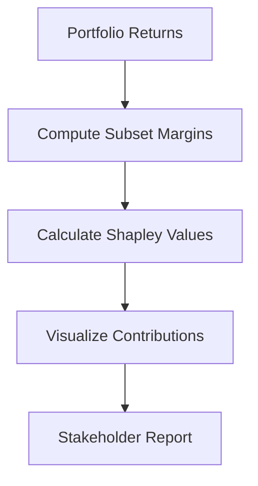

# Day 9: Margin Attribution and Explain Tools

## Objective
Implement Shapley values and other techniques to attribute margin contributions and provide transparency.

## Key Concepts
- __Shapley Values:__ Fairly distribute margin contributions based on each asset’s impact.
- __Aumann-Shapley:__ Scalable method for large portfolios using gradients.
- __Visualization:__ Use interactive dashboards for stakeholder engagement.

## Mathematical Formulation
Shapley Value for Asset $i ):

$$
\phi_i = \sum_{S \subseteq N \setminus {i}} \frac{|S|! (|N| - |S| - 1)!}{|N|!} [v(S \cup {i}) - v(S)]
$$

Where:

- $v(S)$ : Margin for subset $S )
- $N$ : Set of all assets

## Workflow Diagram


## Business Context
- __Transparency:__ Explains margin drivers, aiding portfolio adjustments.
- __Risk Management:__ Identifies high-risk assets, supporting hedging strategies.

---

## [__Day-9 : Notebook__](./notebooks/day9_notebook.ipynb)
```json
{
  "cells": [
    {
      "cell_type": "markdown",
      "metadata": {},
      "source": [
        "# Day 9: Margin Attribution and Explain Tools\n",
        "## Shapley Values for Margin Contributions\n",
        "This notebook implements Shapley values for attributing margin contributions in a portfolio."
      ]
    },
    {
      "cell_type": "code",
      "execution_count": null,
      "metadata": {},
      "outputs": [],
      "source": [
        "import numpy as np\n",
        "import pandas as pd\n",
        "from itertools import combinations\n",
        "\n",
        "def shapley_values(returns: pd.DataFrame, margin_func) -> np.ndarray:\n",
        "    n = returns.shape[1]\n",
        "    shapley = np.zeros(n)\n",
        "    for i in range(n):\n",
        "        marginal_contributions = []\n",
        "        for k in range(n):\n",
        "            for S in combinations(set(range(n)) - {i}, k):\n",
        "                S = list(S)\n",
        "                with_i = S + [i]\n",
        "                marginal_contributions.append(margin_func(returns.iloc[:, with_i]) - margin_func(returns.iloc[:, S]))\n",
        "        shapley[i] = np.mean(marginal_contributions)\n",
        "    return shapley / np.sum(shapley) * 100\n",
        "\n",
        "def margin_func(sub_returns: pd.DataFrame) -> float:\n",
        "    portfolio_returns = sub_returns.sum(axis=1)\n",
        "    return np.percentile(portfolio_returns, 5)\n",
        "\n",
        "# Example usage\n",
        "np.random.seed(42)\n",
        "returns = pd.DataFrame(np.random.normal(0, 0.01, (252, 3)), columns=['Asset1', 'Asset2', 'Asset3'])\n",
        "contributions = shapley_values(returns, margin_func)\n",
        "print(f'Margin Contributions (%): {contributions}')"
      ]
    },
    {
      "cell_type": "markdown",
      "metadata": {},
      "source": [
        "## Notes\n",
        "- **Shapley Values**: Provide fair attribution but computationally intensive.\n",
        "- **Aumann-Shapley**: Scalable for large portfolios using gradient-based methods.\n",
        "- **Visualization**: Use Plotly or Dash for interactive dashboards."
      ]
    }
  ],
  "metadata": {
    "kernelspec": {
      "display_name": "Python 3",
      "language": "python",
      "name": "python3"
    },
    "language_info": {
      "codemirror_mode": {
        "name": "ipython",
        "version": 3
      },
      "file_extension": ".py",
      "mimetype": "text/x-python",
      "name": "python",
      "nbconvert_exporter": "python",
      "pygments_lexer": "ipython3",
      "version": "3.9.0"
    }
  },
  "nbformat": 4,
  "nbformat_minor": 4
}
```

---
