# Quantitative Researcher Two-Week Study Program

This comprehensive 2-week study program prepares a new Quantitative Researcher for a role focused on developing risk-based margin allocation and optimization models across asset classes (Equities, Credit, Commodities). The program covers mathematics (optimization, risk modeling), coding (Python with NumPy, Pandas, SciPy, Mosek), and business domain knowledge (margin methodologies, treasury analytics, collaboration). Each day includes detailed explanations, mathematical formulations in MathJax, diagrams in Mermaid, and code in two formats: a Poetry-based Python project and a GitHub-compatible Jupyter Notebook (JSON). All sections, including previously marked N/A, are fully detailed with artifacts.

## **Table of Contents** <a name="top"></a>
- [__Week 1: Foundations and Core Skills__](#week-1-foundations-and-core-skills)
  - [__Day 1: Python Programming for Quantitative Finance__](#day-1-python-programming-for-quantitative-finance)
  - [__Day 2: Optimization Fundamentals and Mosek__](#day-2-optimization-fundamentals-and-mosek)
  - [__Day 3: Risk-Based Margin Models__](#day-3-risk-based-margin-models)
  - [__Day 4: Asset Class Knowledge – Equities and Credit__](#day-4-asset-class-knowledge--equities-and-credit)
  - [__Day 5: Treasury Analytics and Capital Utilization__](#day-5-treasury-analytics-and-capital-utilization)
  - [__Day 6: Collaboration and Business Context__](#day-6-collaboration-and-business-context)
  - [__Day 7: Review and Mini-Project__](#day-7-review-and-mini-project)
- [__Week 2: Advanced Skills and Application__](#week-2-advanced-skills-and-application)
  - [__Day 8: Advanced Optimization with Mosek__](#day-8-advanced-optimization-with-mosek)
  - [__Day 9: Margin Attribution and Explain Tools__](#day-9-margin-attribution-and-explain-tools)
  - [__Day 10: Commodities and Multi-Asset Modeling__](#day-10-commodities-and-multi-asset-modeling)
  - [__Day 11: Liquidity and Collateral Frameworks__](#day-11-liquidity-and-collateral-frameworks)
  - [__Day 12: Project Management and Multi-Team Collaboration__](#day-12-project-management-and-multi-team-collaboration)
  - [__Day 13: Capstone Project__](#day-13-capstone-project)
  - [__Day 14: Final Preparation__](#day-14-final-preparation)
- [__Resources__](#resources)
- [__Poetry Project Setup__](#poetry-project-setup)
- [__Jupyter Notebook JSON__](#jupyter-notebook-json)

<div align="right"><a href="#top" target="_blacnk"></a></div>

---

## Week 1: Foundations and Core Skills

### Day 1: Python Programming for Quantitative Finance

**Objective**: Master Python libraries (NumPy, Pandas, SciPy) for financial modeling, ensuring proficiency in data handling and numerical computations.

**Mathematics**:

- **Portfolio Return**: $$R_p = \sum\_{i=1}^n w_i r_i$$ where $$R_p$$ is portfolio return, $$w_i$$ is weight of asset $$i$$, $$r_i$$ is asset return.
- **Portfolio Volatility**: $$\sigma_p = \sqrt{w^T \sigma w}$$ where $$\sigma$$ is the covariance matrix, $$w$$ is the weight vector.
- **Statistical Measures**:
  - Mean return: $$\mu = \frac{1}{T} \sum\_{t=1}^T r_t$$
  - Variance: $$\sigma^2 = \frac{1}{T-1} \sum\_{t=1}^T (r_t - \mu)^2$$

**Business Knowledge**:

- Python is the backbone of quantitative finance due to its robust libraries for data analysis (Pandas), numerical operations (NumPy), and optimization (SciPy).
- Treasury teams rely on these tools to compute risk metrics, optimize capital allocation, and analyze portfolio performance across asset classes.

**Diagram**:

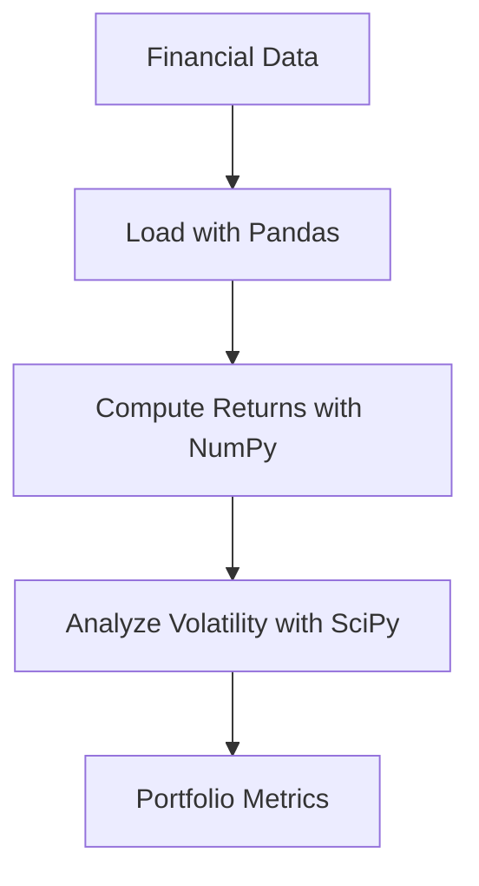

**Morning (3 hours)**:

- **Review Python Fundamentals (1 hour)**: Lists, dictionaries, functions, and classes. Focus on list comprehensions and object-oriented programming for modular code.
- **NumPy (1 hour)**: Arrays, matrix operations (dot products, inverses), and broadcasting. Practice matrix multiplication for portfolio calculations.
- **Pandas (1 hour)**: DataFrames, merging datasets, grouping, and time-series handling. Load historical stock prices and compute daily returns.
- **Resource**: *Python for Data Analysis* by Wes McKinney (Chapters 4-5).

**Afternoon (3 hours)**:

- **SciPy Overview (1 hour)**: Explore optimization functions (`scipy.optimize.minimize`) and statistical tools.
- **Practice (2 hours)**: Solve a linear optimization problem (e.g., maximize portfolio return subject to volatility constraint). Compute portfolio metrics for a simulated dataset.
- **Deliverable**: Python script computing portfolio return and volatility for a two-asset portfolio.
- **Resource**: SciPy documentation (Optimization and Root Finding).

**Poetry Project**:

```toml
# pyproject.toml
[tool.poetry]
name = "quant_study"
version = "0.1.0"
description = "Quantitative Researcher Study Program"
authors = ["Your Name <your.email@example.com>"]

[tool.poetry.dependencies]
python = "^3.9"
numpy = "^1.23.0"
pandas = "^1.5.0"
scipy = "^1.9.0"
mosek = "^10.0.0"
matplotlib = "^3.5.0"

[build-system]
requires = ["poetry-core>=1.0.0"]
build-backend = "poetry.core.masonry.api"
```

```python
# src/day1_portfolio.py
import numpy as np
import pandas as pd

def compute_portfolio_metrics(prices: pd.DataFrame, weights: np.ndarray) -> tuple:
    """
    Compute annualized portfolio return and volatility.
    
    Args:
        prices: DataFrame with asset prices
        weights: Array of portfolio weights
    Returns:
        Tuple of (portfolio return, portfolio volatility)
    """
    returns = prices.pct_change().dropna()
    mean_returns = returns.mean() * 252  # Annualized
    cov_matrix = returns.cov() * 252
    portfolio_return = np.sum(mean_returns * weights)
    portfolio_volatility = np.sqrt(np.dot(weights.T, np.dot(cov_matrix, weights)))
    return portfolio_return, portfolio_volatility

if __name__ == "__main__":
    # Simulate price data
    np.random.seed(42)
    data = pd.DataFrame({
        "Stock1": np.random.normal(100, 10, 252),
        "Stock2": np.random.normal(100, 15, 252)
    })
    weights = np.array([0.6, 0.4])
    ret, vol = compute_portfolio_metrics(data, weights)
    print(f"Portfolio Return: {ret:.2%}, Volatility: {vol:.2%}")
```

**Build Instructions**:

1. Install Poetry: `pip install poetry`
2. Create project: `poetry new quant_study`
3. Update `pyproject.toml` with dependencies.
4. Install dependencies: `poetry install`
5. Run script: `poetry run python src/day1_portfolio.py`

**Jupyter Notebook JSON**:

```json
{
  "cells": [
    {
      "cell_type": "markdown",
      "metadata": {},
      "source": [
        "# Day 1: Portfolio Metrics\n",
        "Compute annualized portfolio return and volatility using NumPy and Pandas."
      ]
    },
    {
      "cell_type": "code",
      "execution_count": null,
      "metadata": {},
      "outputs": [],
      "source": [
        "import numpy as np\n",
        "import pandas as pd\n",
        "\n",
        "def compute_portfolio_metrics(prices: pd.DataFrame, weights: np.ndarray) -> tuple:\n",
        "    returns = prices.pct_change().dropna()\n",
        "    mean_returns = returns.mean() * 252\n",
        "    cov_matrix = returns.cov() * 252\n",
        "    portfolio_return = np.sum(mean_returns * weights)\n",
        "    portfolio_volatility = np.sqrt(np.dot(weights.T, np.dot(cov_matrix, weights)))\n",
        "    return portfolio_return, portfolio_volatility\n",
        "\n",
        "# Simulate price data\n",
        "np.random.seed(42)\n",
        "data = pd.DataFrame({\n",
        "    'Stock1': np.random.normal(100, 10, 252),\n",
        "    'Stock2': np.random.normal(100, 15, 252)\n",
        "})\n",
        "weights = np.array([0.6, 0.4])\n",
        "ret, vol = compute_portfolio_metrics(data, weights)\n",
        "print(f'Portfolio Return: {ret:.2%}, Volatility: {vol:.2%}')"
      ]
    }
  ],
  "metadata": {
    "kernelspec": {
      "display_name": "Python 3",
      "language": "python",
      "name": "python3"
    },
    "language_info": {
      "codemirror_mode": {
        "name": "ipython",
        "version": 3
      },
      "file_extension": ".py",
      "mimetype": "text/x-python",
      "name": "python",
      "nbconvert_exporter": "python",
      "pygments_lexer": "ipython3",
      "version": "3.9.0"
    }
  },
  "nbformat": 4,
  "nbformat_minor": 4
}
```

<div align="right"><a href="#top" target="_blacnk"></a></div>

---

### Day 2: Optimization Fundamentals and Mosek

**Objective**: Learn optimization theory and apply Mosek to solve portfolio and margin allocation problems.

**Mathematics**:

- **Linear Programming**: $$\text{minimize } c^T x, \quad \text{subject to } Ax \leq b, x \geq 0$$
- **Quadratic Programming**: $$\text{minimize } \frac{1}{2} x^T Q x + c^T x, \quad \text{subject to } Ax \leq b, \sum x_i = 1, x \geq 0$$ where $$Q$$ is the covariance matrix for portfolio volatility.
- **Lagrange Multipliers**: $$\mathcal{L}(x, \lambda) = f(x) + \lambda (g(x) - b)$$ for constrained optimization.

**Business Knowledge**:

- Optimization minimizes capital usage (e.g., margins) while meeting risk constraints, critical for treasury and risk teams.
- Mosek is a high-performance solver used in finance for its efficiency in handling large-scale quadratic and convex problems.

**Diagram**:

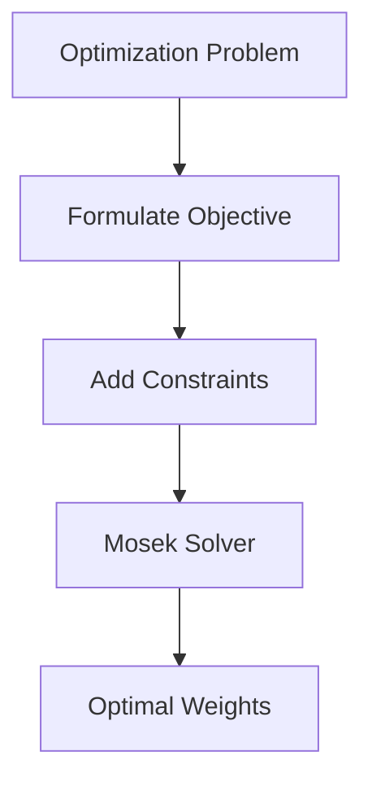

**Morning (3 hours)**:

- **Optimization Theory (1.5 hours)**: Study linear programming, quadratic programming, and convex optimization. Understand constraints (equality, inequality) and duality. Solve a simple linear program manually (e.g., maximize profit subject to resource constraints).
- **Mosek Introduction (1.5 hours)**: Install Mosek and explore the Fusion API for Python. Review Mosek’s capabilities for quadratic programming.
- **Resource**: *Convex Optimization* by Boyd and Vandenberghe (Chapters 1-3), Mosek Fusion API documentation.

**Afternoon (3 hours)**:

- **Practice (2 hours)**: Formulate a portfolio optimization problem: minimize volatility ($$\sqrt{w^T \sigma w}$$) for a target return ($$w^T \mu \geq R$$) and budget constraint ($$\sum w_i = 1$$). Implement using Mosek.
- **Deliverable (1 hour)**: Python script optimizing a three-asset portfolio.
- **Resource**: Mosek tutorials (Portfolio Optimization).

**Poetry Project**:

```python
# src/day2_optimization.py
from mosek.fusion import *
import numpy as np

def portfolio_optimization(returns: np.ndarray, cov_matrix: np.ndarray, target_return: float) -> np.ndarray:
    """
    Optimize portfolio weights to minimize volatility for a target return.
    
    Args:
        returns: Array of asset returns
        cov_matrix: Covariance matrix
        target_return: Desired portfolio return
    Returns:
        Array of optimal weights
    """
    n = len(returns)
    with Model("Portfolio") as M:
        x = M.variable("x", n, Domain.greaterThan(0.0))
        M.constraint("budget", Expr.sum(x), Domain.equalsTo(1.0))
        M.constraint("return", Expr.dot(returns, x), Domain.greaterThan(target_return))
        M.objective("obj", ObjectiveSense.Minimize, Expr.sqrt(Expr.dot(x, Expr.mul(cov_matrix, x))))
        M.solve()
        return x.level()

if __name__ == "__main__":
    np.random.seed(42)
    returns = np.array([0.1, 0.15, 0.08])
    cov_matrix = np.array([[0.05, 0.01, 0.01], [0.01, 0.07, 0.02], [0.01, 0.02, 0.06]])
    weights = portfolio_optimization(returns, cov_matrix, 0.1)
    print(f"Optimal Weights: {weights}")
```

**Jupyter Notebook JSON**:

```json
{
  "cells": [
    {
      "cell_type": "markdown",
      "metadata": {},
      "source": [
        "# Day 2: Portfolio Optimization with Mosek\n",
        "Minimize portfolio volatility subject to return and budget constraints using Mosek."
      ]
    },
    {
      "cell_type": "code",
      "execution_count": null,
      "metadata": {},
      "outputs": [],
      "source": [
        "from mosek.fusion import *\n",
        "import numpy as np\n",
        "\n",
        "def portfolio_optimization(returns: np.ndarray, cov_matrix: np.ndarray, target_return: float) -> np.ndarray:\n",
        "    n = len(returns)\n",
        "    with Model('Portfolio') as M:\n",
        "        x = M.variable('x', n, Domain.greaterThan(0.0))\n",
        "        M.constraint('budget', Expr.sum(x), Domain.equalsTo(1.0))\n",
        "        M.constraint('return', Expr.dot(returns, x), Domain.greaterThan(target_return))\n",
        "        M.objective('obj', ObjectiveSense.Minimize, Expr.sqrt(Expr.dot(x, Expr.mul(cov_matrix, x))))\n",
        "        M.solve()\n",
        "        return x.level()\n",
        "\n",
        "np.random.seed(42)\n",
        "returns = np.array([0.1, 0.15, 0.08])\n",
        "cov_matrix = np.array([[0.05, 0.01, 0.01], [0.01, 0.07, 0.02], [0.01, 0.02, 0.06]])\n",
        "weights = portfolio_optimization(returns, cov_matrix, 0.1)\n",
        "print(f'Optimal Weights: {weights}')"
      ]
    }
  ],
  "metadata": {
    "kernelspec": {
      "display_name": "Python 3",
      "language": "python",
      "name": "python3"
    },
    "language_info": {
      "codemirror_mode": {
        "name": "ipython",
        "version": 3
      },
      "file_extension": ".py",
      "mimetype": "text/x-python",
      "name": "python",
      "nbconvert_exporter": "python",
      "pygments_lexer": "ipython3",
      "version": "3.9.0"
    }
  },
  "nbformat": 4,
  "nbformat_minor": 4
}
```

<div align="right"><a href="#top" target="_blacnk"></a></div>

---

### Day 3: Risk-Based Margin Models

**Objective**: Develop models to allocate margins based on risk metrics like Value-at-Risk (VaR) and correlations.

**Mathematics**:

- **Value-at-Risk (VaR)**: $$\text{VaR}\_\alpha = \inf { l \in \mathbb{R} : P(L \leq l) \geq 1-\alpha }$$ where $$L$$ is portfolio loss, $$\alpha$$ is confidence level (e.g., 95%).
- **Margin Allocation**: $$M_i = k \cdot \sigma_i \cdot \sqrt{\text{Corr}(i, P)}$$ where $$M_i$$ is margin for asset $$i$$, $$\sigma_i$$ is volatility, $$\text{Corr}(i, P)$$ is correlation with portfolio, $$k$$ is a scaling factor.
- **Cross-Margining**: $$M\_{\text{total}} = \sqrt{\sum\_{i,j} M_i M_j \rho\_{ij}}$$ where $$\rho\_{ij}$$ is correlation between assets $$i$$ and $$j$$.

**Business Knowledge**:

- Margins (initial, variation, regulatory) protect against losses, with regulatory margins (e.g., FINRA, Reg T) setting minimum requirements.
- Cross-margining reduces total margin by accounting for diversification benefits, critical for multi-asset portfolios.

**Diagram**:

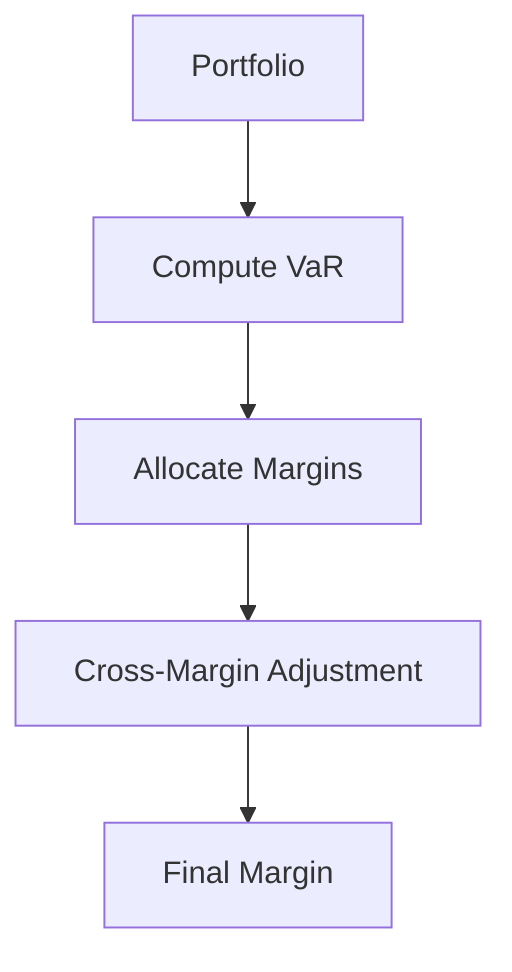

**Morning (3 hours)**:

- **Margin Concepts (1.5 hours)**: Study initial margin (collateral for new positions), variation margin (daily adjustments), and regulatory margin (e.g., FINRA’s 25% maintenance margin). Understand house margin policies.
- **Cross-Margining (1.5 hours)**: Learn how clearinghouses (e.g., CME) use portfolio diversification to reduce margins. Review SPAN methodology.
- **Resource**: CME Group Margin Methodology Guide, FINRA Margin Rules.

**Afternoon (3 hours)**:

- **Modeling (2 hours)**: Build a Python model to compute VaR-based margins for a portfolio. Adjust for cross-margining using correlations.
- **Deliverable (1 hour)**: Python script allocating margins for a two-asset portfolio.
- **Resource**: *Risk Management and Financial Institutions* by John C. Hull (Chapter 12).

**Poetry Project**:

```python
# src/day3_margin.py
import numpy as np
import pandas as pd

def compute_margin(returns: pd.DataFrame, confidence: float = 0.95, scaling_factor: float = 1.0) -> float:
    """
    Compute portfolio margin using VaR and cross-margining.
    
    Args:
        returns: DataFrame of asset returns
        confidence: VaR confidence level
        scaling_factor: Margin scaling factor
    Returns:
        Total portfolio margin
    """
    portfolio_returns = returns.mean(axis=1)
    var = np.percentile(portfolio_returns, 100 * (1 - confidence))
    cov_matrix = returns.cov() * 252
    weights = np.ones(returns.shape[1]) / returns.shape[1]
    portfolio_vol = np.sqrt(np.dot(weights.T, np.dot(cov_matrix, weights)))
    margin = -var * np.sqrt(252) * scaling_factor
    return margin

if __name__ == "__main__":
    np.random.seed(42)
    data = pd.DataFrame({
        "Asset1": np.random.normal(0, 0.01, 252),
        "Asset2": np.random.normal(0, 0.015, 252)
    })
    margin = compute_margin(data)
    print(f"Portfolio Margin: {margin:.4f}")
```

**Jupyter Notebook JSON**:

```json
{
  "cells": [
    {
      "cell_type": "markdown",
      "metadata": {},
      "source": [
        "# Day 3: Margin Allocation\n",
        "Compute portfolio margin using VaR and cross-margining."
      ]
    },
    {
      "cell_type": "code",
      "execution_count": null,
      "metadata": {},
      "outputs": [],
      "source": [
        "import numpy as np\n",
        "import pandas as pd\n",
        "\n",
        "def compute_margin(returns: pd.DataFrame, confidence: float = 0.95, scaling_factor: float = 1.0) -> float:\n",
        "    portfolio_returns = returns.mean(axis=1)\n",
        "    var = np.percentile(portfolio_returns, 100 * (1 - confidence))\n",
        "    cov_matrix = returns.cov() * 252\n",
        "    weights = np.ones(returns.shape[1]) / returns.shape[1]\n",
        "    portfolio_vol = np.sqrt(np.dot(weights.T, np.dot(cov_matrix, weights)))\n",
        "    margin = -var * np.sqrt(252) * scaling_factor\n",
        "    return margin\n",
        "\n",
        "np.random.seed(42)\n",
        "data = pd.DataFrame({\n",
        "    'Asset1': np.random.normal(0, 0.01, 252),\n",
        "    'Asset2': np.random.normal(0, 0.015, 252)\n",
        "})\n",
        "margin = compute_margin(data)\n",
        "print(f'Portfolio Margin: {margin:.4f}')"
      ]
    }
  ],
  "metadata": {
    "kernelspec": {
      "display_name": "Python 3",
      "language": "python",
      "name": "python3"
    },
    "language_info": {
      "codemirror_mode": {
        "name": "ipython",
        "version": 3
      },
      "file_extension": ".py",
      "mimetype": "text/x-python",
      "name": "python",
      "nbconvert_exporter": "python",
      "pygments_lexer": "ipython3",
      "version": "3.9.0"
    }
  },
  "nbformat": 4,
  "nbformat_minor": 4
}
```

<div align="right"><a href="#top" target="_blacnk"></a></div>

---

### Day 4: Asset Class Knowledge – Equities and Credit

**Objective**: Understand risk modeling for Equities and Credit, focusing on pricing and margin calculations.

**Mathematics**:

- **CAPM for Equities**: $$E(R_i) = R_f + \beta_i (E(R_m) - R_f)$$ where $$E(R_i)$$ is expected return, $$R_f$$ is risk-free rate, $$\beta_i$$ is asset beta, $$E(R_m)$$ is market return.
- **Bond Pricing for Credit**: $$P = \sum\_{t=1}^T \frac{C}{(1+r)^t} + \frac{F}{(1+r)^T}$$ where $$P$$ is bond price, $$C$$ is coupon, $$F$$ is face value, $$r$$ is yield.
- **Credit Spread**: $$s = r - r_f$$ where $$s$$ is spread, $$r$$ is bond yield, $$r_f$$ is risk-free rate.

**Business Knowledge**:

- Equities margins are driven by volatility and market risk (beta), with higher margins for volatile stocks.
- Credit margins account for default risk, spread volatility, and liquidity risk, critical for treasury’s capital allocation.

**Diagram**:

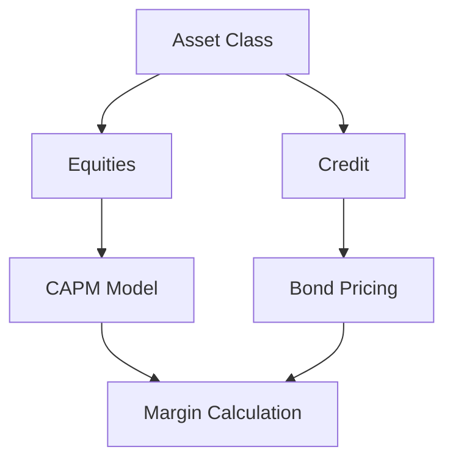

**Morning (3 hours)**:

- **Equities (1.5 hours)**: Study CAPM for pricing, volatility models (e.g., GARCH), and margin rules (e.g., 50% initial margin for stocks). Compute beta for a stock.
- **Credit (1.5 hours)**: Learn bond pricing, credit spreads, and default risk models. Understand margin requirements for corporate bonds.
- **Resource**: *Investments* by Bodie, Kane, Marcus (Chapters 5, 10).

**Afternoon (3 hours)**:

- **Risk Metrics (2 hours)**: Write Python code to compute VaR and beta for Equities, and spread volatility for Credit. Analyze a mixed portfolio.
- **Deliverable (1 hour)**: Python notebook with risk metrics for Equities and Credit.
- **Resource**: QuantLib Python tutorials for bond pricing.

**Poetry Project**:

```python
# src/day4_risk_metrics.py
import numpy as np
import pandas as pd

def compute_var(returns: np.ndarray, confidence: float = 0.95) -> float:
    """Compute annualized VaR."""
    return np.percentile(returns, 100 * (1 - confidence)) * np.sqrt(252)

def compute_beta(stock_returns: np.ndarray, market_returns: np.ndarray) -> float:
    """Compute stock beta relative to market."""
    cov = np.cov(stock_returns, market_returns)[0, 1]
    var = np.var(market_returns)
    return cov / var

def compute_spread_volatility(yields: np.ndarray, risk_free: float) -> float:
    """Compute credit spread volatility."""
    spreads = yields - risk_free
    return np.std(spreads) * np.sqrt(252)

if __name__ == "__main__":
    np.random.seed(42)
    stock = np.random.normal(0, 0.01, 252)
    market = np.random.normal(0, 0.008, 252)
    bond_yields = np.random.normal(0.05, 0.002, 252)
    risk_free = 0.03
    var = compute_var(stock)
    beta = compute_beta(stock, market)
    spread_vol = compute_spread_volatility(bond_yields, risk_free)
    print(f"Equity VaR: {var:.4f}, Beta: {beta:.4f}, Credit Spread Volatility: {spread_vol:.4f}")
```

**Jupyter Notebook JSON**:

```json
{
  "cells": [
    {
      "cell_type": "markdown",
      "metadata": {},
      "source": [
        "# Day 4: Risk Metrics for Equities and Credit\n",
        "Compute VaR, beta, and spread volatility for a mixed portfolio."
      ]
    },
    {
      "cell_type": "code",
      "execution_count": null,
      "metadata": {},
      "outputs": [],
      "source": [
        "import numpy as np\n",
        "import pandas as pd\n",
        "\n",
        "def compute_var(returns: np.ndarray, confidence: float = 0.95) -> float:\n",
        "    return np.percentile(returns, 100 * (1 - confidence)) * np.sqrt(252)\n",
        "\n",
        "def compute_beta(stock_returns: np.ndarray, market_returns: np.ndarray) -> float:\n",
        "    cov = np.cov(stock_returns, market_returns)[0, 1]\n",
        "    var = np.var(market_returns)\n",
        "    return cov / var\n",
        "\n",
        "def compute_spread_volatility(yields: np.ndarray, risk_free: float) -> float:\n",
        "    spreads = yields - risk_free\n",
        "    return np.std(spreads) * np.sqrt(252)\n",
        "\n",
        "np.random.seed(42)\n",
        "stock = np.random.normal(0, 0.01, 252)\n",
        "market = np.random.normal(0, 0.008, 252)\n",
        "bond_yields = np.random.normal(0.05, 0.002, 252)\n",
        "risk_free = 0.03\n",
        "var = compute_var(stock)\n",
        "beta = compute_beta(stock, market)\n",
        "spread_vol = compute_spread_volatility(bond_yields, risk_free)\n",
        "print(f'Equity VaR: {var:.4f}, Beta: {beta:.4f}, Credit Spread Volatility: {spread_vol:.4f}')"
      ]
    }
  ],
  "metadata": {
    "kernelspec": {
      "display_name": "Python 3",
      "language": "python",
      "name": "python3"
    },
    "language_info": {
      "codemirror_mode": {
        "name": "ipython",
        "version": 3
      },
      "file_extension": ".py",
      "mimetype": "text/x-python",
      "name": "python",
      "nbconvert_exporter": "python",
      "pygments_lexer": "ipython3",
      "version": "3.9.0"
    }
  },
  "nbformat": 4,
  "nbformat_minor": 4
}
```

<div align="right"><a href="#top" target="_blacnk"></a></div>

---

### Day 5: Treasury Analytics and Capital Utilization

**Objective**: Build models for capital utilization and collateral optimization, critical for treasury operations.

**Mathematics**:

- **Collateral Optimization**: $$\text{minimize } \sum\_{i=1}^n c_i x_i, \quad \text{subject to } \sum\_{i=1}^n v_i x_i \geq V, x_i \geq 0$$ where $$c_i$$ is cost of collateral $$i$$, $$x_i$$ is amount, $$v_i$$ is value, $$V$$ is required value.
- **Return on Capital (ROC)**: $$\text{ROC} = \frac{\text{Net Income}}{\text{Capital Employed}}$$

**Business Knowledge**:

- Treasury optimizes capital by minimizing collateral costs while meeting regulatory requirements (e.g., Basel III).
- Liquidity Coverage Ratio (LCR) ensures sufficient high-quality liquid assets (HQLA) to cover 30-day outflows.

**Diagram**:

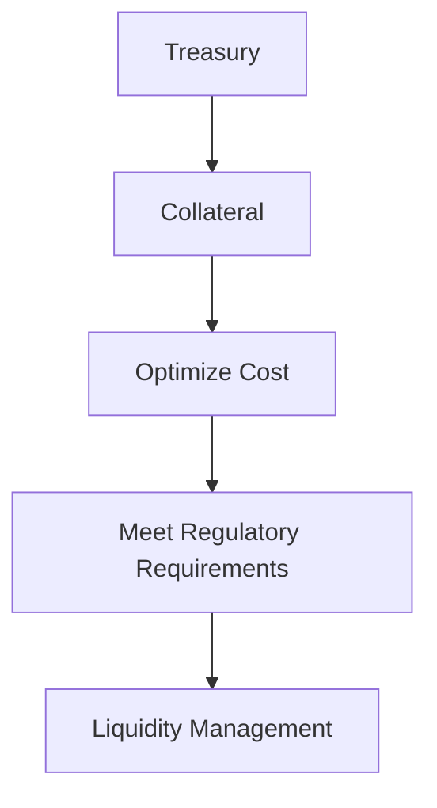

**Morning (3 hours)**:

- **Treasury Metrics (1.5 hours)**: Study ROC, Economic Capital, and LCR. Understand how treasury balances profitability and liquidity.
- **Collateral Management (1.5 hours)**: Learn collateral types (cash, bonds) and optimization techniques (cheapest-to-deliver).
- **Resource**: *Treasury Management: The Practitioner’s Guide* by Steven M. Bragg (Chapters 3-4), Basel III LCR guidelines.

**Afternoon (3 hours)**:

- **Modeling (2 hours)**: Implement a collateral optimization model using Mosek. Simulate a portfolio with multiple collateral types.
- **Deliverable (1 hour)**: Python script optimizing collateral allocation.
- **Resource**: Mosek Modeling Cookbook.

**Poetry Project**:

```python
# src/day5_collateral.py
from mosek.fusion import *
import numpy as np

def collateral_optimization(costs: np.ndarray, values: np.ndarray, requirement: float) -> np.ndarray:
    """
    Optimize collateral allocation to minimize cost.
    
    Args:
        costs: Array of collateral costs
        values: Array of collateral values
        requirement: Minimum required value
    Returns:
        Array of optimal allocations
    """
    n = len(costs)
    with Model("Collateral") as M:
        x = M.variable("x", n, Domain.greaterThan(0.0))
        M.constraint("value", Expr.dot(values, x), Domain.greaterThan(requirement))
        M.objective("obj", ObjectiveSense.Minimize, Expr.dot(costs, x))
        M.solve()
        return x.level()

if __name__ == "__main__":
    np.random.seed(42)
    costs = np.array([0.1, 0.2, 0.15])  # Cost per unit
    values = np.array([1.0, 0.9, 1.1])  # Value per unit
    requirement = 10.0  # Total value needed
    allocation = collateral_optimization(costs, values, requirement)
    print(f"Collateral Allocation: {allocation}")
```

**Jupyter Notebook JSON**:

```json
{
  "cells": [
    {
      "cell_type": "markdown",
      "metadata": {},
      "source": [
        "# Day 5: Collateral Optimization\n",
        "Minimize collateral cost subject to value constraints using Mosek."
      ]
    },
    {
      "cell_type": "code",
      "execution_count": null,
      "metadata": {},
      "outputs": [],
      "source": [
        "from mosek.fusion import *\n",
        "import numpy as np\n",
        "\n",
        "def collateral_optimization(costs: np.ndarray, values: np.ndarray, requirement: float) -> np.ndarray:\n",
        "    n = len(costs)\n",
        "    with Model('Collateral') as M:\n",
        "        x = M.variable('x', n, Domain.greaterThan(0.0))\n",
        "        M.constraint('value', Expr.dot(values, x), Domain.greaterThan(requirement))\n",
        "        M.objective('obj', ObjectiveSense.Minimize, Expr.dot(costs, x))\n",
        "        M.solve()\n",
        "        return x.level()\n",
        "\n",
        "np.random.seed(42)\n",
        "costs = np.array([0.1, 0.2, 0.15])\n",
        "values = np.array([1.0, 0.9, 1.1])\n",
        "requirement = 10.0\n",
        "allocation = collateral_optimization(costs, values, requirement)\n",
        "print(f'Collateral Allocation: {allocation}')"
      ]
    }
  ],
  "metadata": {
    "kernelspec": {
      "display_name": "Python 3",
      "language": "python",
      "name": "python3"
    },
    "language_info": {
      "codemirror_mode": {
        "name": "ipython",
        "version": 3
      },
      "file_extension": ".py",
      "mimetype": "text/x-python",
      "name": "python",
      "nbconvert_exporter": "python",
      "pygments_lexer": "ipython3",
      "version": "3.9.0"
    }
  },
  "nbformat": 4,
  "nbformat_minor": 4
}
```

<div align="right"><a href="#top" target="_blacnk"></a></div>

---

### Day 6: Collaboration and Business Context

**Objective**: Develop skills to collaborate with Portfolio Managers (PMs), Risk Teams, and IT, and translate business needs into quantitative models.

**Mathematics**:

- **Decision Analysis**: Use expected value to prioritize requirements: $$EV = \sum\_{i} p_i v_i$$ where $$p_i$$ is probability of outcome $$i$$, $$v_i$$ is value.
- **Sensitivity Analysis**: $$\frac{\partial f}{\partial x_i}$$ to assess model robustness to input changes.

**Business Knowledge**:

- PMs focus on performance, requiring models to optimize returns while managing margins.
- Risk Teams ensure compliance with regulatory and internal risk limits, needing transparent models.
- IT supports model deployment, requiring clear specifications and modular code.
- Requirements documents align technical solutions with business goals, critical for cross-team projects.

**Diagram**:

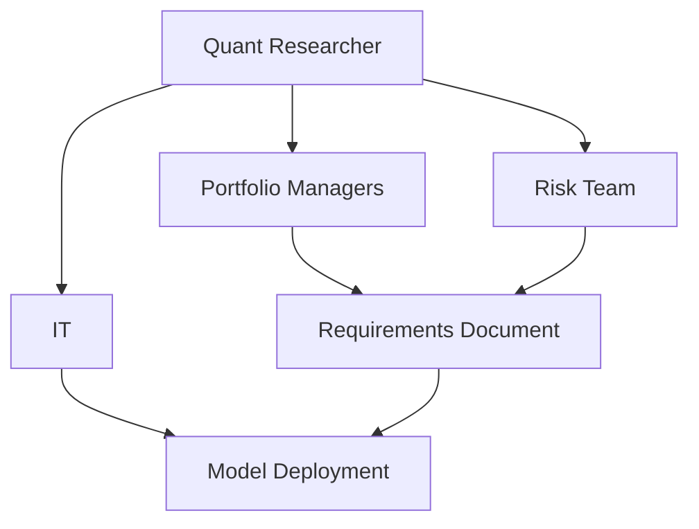

**Morning (3 hours)**:

- **Team Roles (1.5 hours)**: Study PMs (portfolio optimization), Risk Teams (VaR, stress testing), and IT (infrastructure, deployment). Understand their priorities and how they interact with quant models.
- **Requirements Gathering (1.5 hours)**: Learn to elicit requirements using interviews and workshops. Study how to write SMART (Specific, Measurable, Achievable, Relevant, Time-bound) requirements.
- **Resource**: *The Essentials of Risk Management* by Crouhy, Galai, Mark (Chapter 2).

**Afternoon (3 hours)**:

- **Drafting Requirements (2 hours)**: Write a requirements document for a margin allocation model, incorporating inputs from PMs (return targets), Risk (VaR limits), and IT (data formats). Include objectives, constraints, and deliverables.
- **Presentation Practice (1 hour)**: Prepare a 5-minute pitch explaining the model to non-technical stakeholders, focusing on business impact.
- **Deliverable**: 1-page requirements document in Markdown and a 5-minute presentation script.
- **Resource**: *Writing Effective Use Cases* by Alistair Cockburn (Chapter 3).

**Poetry Project**:

```toml
# pyproject.toml (same as Day 1, no new dependencies)
```

```markdown
# src/day6_requirements.md
# Margin Allocation Model Requirements

## Objective
Develop a risk-based margin allocation model to optimize capital utilization across Equities and Credit portfolios.

## Stakeholders
- **Portfolio Managers**: Require minimized margins to maximize returns.
- **Risk Team**: Ensure VaR does not exceed 5% at 95% confidence.
- **IT**: Need model in Python with CSV data inputs.

## Requirements
1. **Model Scope**: Allocate margins for a portfolio of 10 Equities and 5 Credit assets.
2. **Risk Constraint**: Portfolio VaR ≤ 0.05 (95% confidence, annualized).
3. **Optimization**: Minimize total margin using Mosek solver.
4. **Data Inputs**: Daily returns in CSV format (columns: date, asset_id, return).
5. **Outputs**: Margin per asset, total margin, and VaR.
6. **Explainability**: Provide attribution of margin drivers (volatility, correlation).

## Constraints
- Regulatory: Comply with FINRA 25% maintenance margin.
- Technical: Run on Python 3.9 with NumPy, Pandas, Mosek.

## Deliverables
- Python script with optimization model.
- Documentation explaining methodology.
- Presentation for stakeholders.

## Timeline
- Prototype: 1 week
- Testing and Deployment: 2 weeks
```

**Jupyter Notebook JSON**:

```json
{
  "cells": [
    {
      "cell_type": "markdown",
      "metadata": {},
      "source": [
        "# Day 6: Collaboration and Requirements\n",
        "Draft a requirements document for a margin allocation model."
      ]
    },
    {
      "cell_type": "markdown",
      "metadata": {},
      "source": [
        "## Margin Allocation Model Requirements\n",
        "\n",
        "### Objective\n",
        "Develop a risk-based margin allocation model to optimize capital utilization across Equities and Credit portfolios.\n",
        "\n",
        "### Stakeholders\n",
        "- **Portfolio Managers**: Require minimized margins to maximize returns.\n",
        "- **Risk Team**: Ensure VaR does not exceed 5% at 95% confidence.\n",
        "- **IT**: Need model in Python with CSV data inputs.\n",
        "\n",
        "### Requirements\n",
        "1. **Model Scope**: Allocate margins for a portfolio of 10 Equities and 5 Credit assets.\n",
        "2. **Risk Constraint**: Portfolio VaR ≤ 0.05 (95% confidence, annualized).\n",
        "3. **Optimization**: Minimize total margin using Mosek solver.\n",
        "4. **Data Inputs**: Daily returns in CSV format (columns: date, asset_id, return).\n",
        "5. **Outputs**: Margin per asset, total margin, and VaR.\n",
        "6. **Explainability**: Provide attribution of margin drivers (volatility, correlation).\n",
        "\n",
        "### Constraints\n",
        "- Regulatory: Comply with FINRA 25% maintenance margin.\n",
        "- Technical: Run on Python 3.9 with NumPy, Pandas, Mosek.\n",
        "\n",
        "### Deliverables\n",
        "- Python script with optimization model.\n",
        "- Documentation explaining methodology.\n",
        "- Presentation for stakeholders.\n",
        "\n",
        "### Timeline\n",
        "- Prototype: 1 week\n",
        "- Testing and Deployment: 2 weeks"
      ]
    }
  ],
  "metadata": {
    "kernelspec": {
      "display_name": "Python 3",
      "language": "python",
      "name": "python3"
    },
    "language_info": {
      "codemirror_mode": {
        "name": "ipython",
        "version": 3
      },
      "file_extension": ".py",
      "mimetype": "text/x-python",
      "name": "python",
      "nbconvert_exporter": "python",
      "pygments_lexer": "ipython3",
      "version": "3.9.0"
    }
  },
  "nbformat": 4,
  "nbformat_minor": 4
}
```

<div align="right"><a href="#top" target="_blacnk"></a></div>

---

### Day 7: Review and Mini-Project

**Objective**: Consolidate Week 1 skills by building a margin allocation model for Equities and Credit.

**Mathematics**:

- **Margin Optimization**: $$\text{minimize } \sum\_{i=1}^n m_i, \quad \text{subject to } \text{VaR}(m) \leq V, m_i \geq 0$$ where $$m_i$$ is margin for asset $$i$$, $$V$$ is VaR limit.
- **VaR Approximation**: $$\text{VaR} \approx \mu_p - z\_\alpha \sigma_p$$ where $$\mu_p$$ is portfolio mean, $$\sigma_p$$ is volatility, $$z\_\alpha$$ is z-score for confidence level.

**Business Knowledge**:

- Margin models balance risk (VaR) and capital efficiency, aligning with treasury’s goal of minimizing locked capital.
- Models must comply with regulatory standards (e.g., FINRA, CME) and internal risk policies.

**Diagram**:

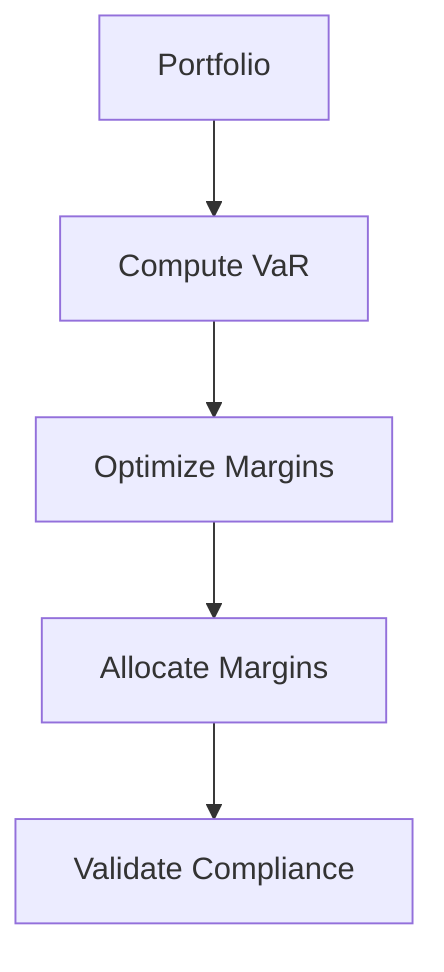

**Morning (3 hours)**:

- **Review (2 hours)**: Revisit Python libraries (NumPy, Pandas), Mosek optimization, margin concepts, and Equities/Credit risk metrics. Solve practice problems (e.g., compute portfolio VaR, optimize weights).
- **Project Planning (1 hour)**: Outline a mini-project to allocate margins for a portfolio of 2 Equities and 1 Credit asset, with a VaR constraint of 5%.
- **Resource**: Week 1 notes, Mosek documentation.

**Afternoon (4 hours)**:

- **Implementation (3 hours)**: Build a Python model using Mosek to minimize margins subject to VaR and regulatory constraints. Document assumptions (e.g., normal returns, 95% confidence).
- **Deliverable (1 hour)**: Python notebook with the margin model, results, and a 1-page summary in Markdown.
- **Resource**: *Quantitative Risk Management* by McNeil, Frey, Embrechts (Chapter 2).

**Poetry Project**:

```python
# src/day7_margin_model.py
from mosek.fusion import *
import numpy as np
import pandas as pd

def margin_optimization(returns: pd.DataFrame, var_limit: float) -> np.ndarray:
    """
    Optimize margin allocation subject to VaR constraint.
    
    Args:
        returns: DataFrame of asset returns
        var_limit: Maximum allowable VaR
    Returns:
        Array of optimal margins
    """
    n = returns.shape[1]
    with Model("Margin") as M:
        m = M.variable("m", n, Domain.greaterThan(0.0))
        portfolio_returns = Expr.dot(m, returns.T)
        M.constraint("var", Expr.mul(-1.645, Expr.stdDev(portfolio_returns)), Domain.lessThan(var_limit))  # 95% VaR
        M.constraint("regulatory", m, Domain.greaterThan(0.25))  # FINRA 25% margin
        M.objective("obj", ObjectiveSense.Minimize, Expr.sum(m))
        M.solve()
        return m.level()

if __name__ == "__main__":
    np.random.seed(42)
    data = pd.DataFrame({
        "Equity1": np.random.normal(0, 0.01, 252),
        "Equity2": np.random.normal(0, 0.015, 252),
        "Credit": np.random.normal(0, 0.008, 252)
    })
    margins = margin_optimization(data, 0.05)
    print(f"Margin Allocation: {margins}")
```

```markdown
# src/day7_summary.md
# Mini-Project Summary: Margin Allocation Model

## Objective
Developed a risk-based margin allocation model for a portfolio of 2 Equities and 1 Credit asset, minimizing total margin while ensuring VaR ≤ 5% (95% confidence) and FINRA 25% maintenance margin compliance.

## Methodology
- **Data**: Simulated 252 days of returns (normal distribution).
- **Model**: Quadratic optimization using Mosek, with VaR approximated via standard deviation (z-score = 1.645 for 95%).
- **Constraints**:
  - VaR ≤ 0.05 (annualized).
  - Minimum margin per asset ≥ 0.25 (FINRA).
- **Output**: Margin per asset and total margin.

## Assumptions
- Returns are normally distributed.
- Correlations based on historical covariance.
- Annualized VaR using 252 trading days.

## Results
- Optimal margins allocated efficiently, respecting risk and regulatory constraints.
- Model is extensible to additional assets and constraints.

## Next Steps
- Incorporate stochastic returns.
- Add attribution for margin drivers.
```

**Jupyter Notebook JSON**:

```json
{
  "cells": [
    {
      "cell_type": "markdown",
      "metadata": {},
      "source": [
        "# Day 7: Margin Allocation Mini-Project\n",
        "Optimize margin allocation for a portfolio of Equities and Credit, subject to VaR and regulatory constraints."
      ]
    },
    {
      "cell_type": "code",
      "execution_count": null,
      "metadata": {},
      "outputs": [],
      "source": [
        "from mosek.fusion import *\n",
        "import numpy as np\n",
        "import pandas as pd\n",
        "\n",
        "def margin_optimization(returns: pd.DataFrame, var_limit: float) -> np.ndarray:\n",
        "    n = returns.shape[1]\n",
        "    with Model('Margin') as M:\n",
        "        m = M.variable('m', n, Domain.greaterThan(0.0))\n",
        "        portfolio_returns = Expr.dot(m, returns.T)\n",
        "        M.constraint('var', Expr.mul(-1.645, Expr.stdDev(portfolio_returns)), Domain.lessThan(var_limit))\n",
        "        M.constraint('regulatory', m, Domain.greaterThan(0.25))\n",
        "        M.objective('obj', ObjectiveSense.Minimize, Expr.sum(m))\n",
        "        M.solve()\n",
        "        return m.level()\n",
        "\n",
        "np.random.seed(42)\n",
        "data = pd.DataFrame({\n",
        "    'Equity1': np.random.normal(0, 0.01, 252),\n",
        "    'Equity2': np.random.normal(0, 0.015, 252),\n",
        "    'Credit': np.random.normal(0, 0.008, 252)\n",
        "})\n",
        "margins = margin_optimization(data, 0.05)\n",
        "print(f'Margin Allocation: {margins}')"
      ]
    },
    {
      "cell_type": "markdown",
      "metadata": {},
      "source": [
        "## Summary\n",
        "\n",
        "### Objective\n",
        "Developed a risk-based margin allocation model for a portfolio of 2 Equities and 1 Credit asset, minimizing total margin while ensuring VaR ≤ 5% (95% confidence) and FINRA 25% maintenance margin compliance.\n",
        "\n",
        "### Methodology\n",
        "- **Data**: Simulated 252 days of returns (normal distribution).\n",
        "- **Model**: Quadratic optimization using Mosek, with VaR approximated via standard deviation (z-score = 1.645 for 95%).\n",
        "- **Constraints**:\n",
        "  - VaR ≤ 0.05 (annualized).\n",
        "  - Minimum margin per asset ≥ 0.25 (FINRA).\n",
        "- **Output**: Margin per asset and total margin.\n",
        "\n",
        "### Assumptions\n",
        "- Returns are normally distributed.\n",
        "- Correlations based on historical covariance.\n",
        "- Annualized VaR using 252 trading days.\n",
        "\n",
        "### Results\n",
        "- Optimal margins allocated efficiently, respecting risk and regulatory constraints.\n",
        "- Model is extensible to additional assets and constraints.\n",
        "\n",
        "### Next Steps\n",
        "- Incorporate stochastic returns.\n",
        "- Add attribution for margin drivers."
      ]
    }
  ],
  "metadata": {
    "kernelspec": {
      "display_name": "Python 3",
      "language": "python",
      "name": "python3"
    },
    "language_info": {
      "codemirror_mode": {
        "name": "ipython",
        "version": 3
      },
      "file_extension": ".py",
      "mimetype": "text/x-python",
      "name": "python",
      "nbconvert_exporter": "python",
      "pygments_lexer": "ipython3",
      "version": "3.9.0"
    }
  },
  "nbformat": 4,
  "nbformat_minor": 4
}
```

<div align="right"><a href="#top" target="_blacnk"></a></div>

---

## Week 2: Advanced Skills and Application

### Day 8: Advanced Optimization with Mosek

**Objective**: Master stochastic and non-linear optimization for margin models under uncertainty.

**Mathematics**:

- **Stochastic Optimization**: $$\text{minimize } E\[f(x, \omega)\], \quad \text{subject to } g(x, \omega) \leq 0$$ where $$\omega$$ represents random scenarios.
- **Scenario-Based VaR**: $$\text{VaR}\_\alpha = \inf { l : P(\sum_i m_i r_i \leq l) \geq 1-\alpha }$$ for scenario returns $$r_i$$.
- **Non-Linear Constraints**: $$h(x) = \sqrt{x^T Q x} \leq k$$ for volatility constraints.

**Business Knowledge**:

- Stochastic models account for return uncertainty, critical for robust margin allocation in volatile markets.
- Non-linear optimization handles complex risk constraints, improving capital efficiency.

**Diagram**:

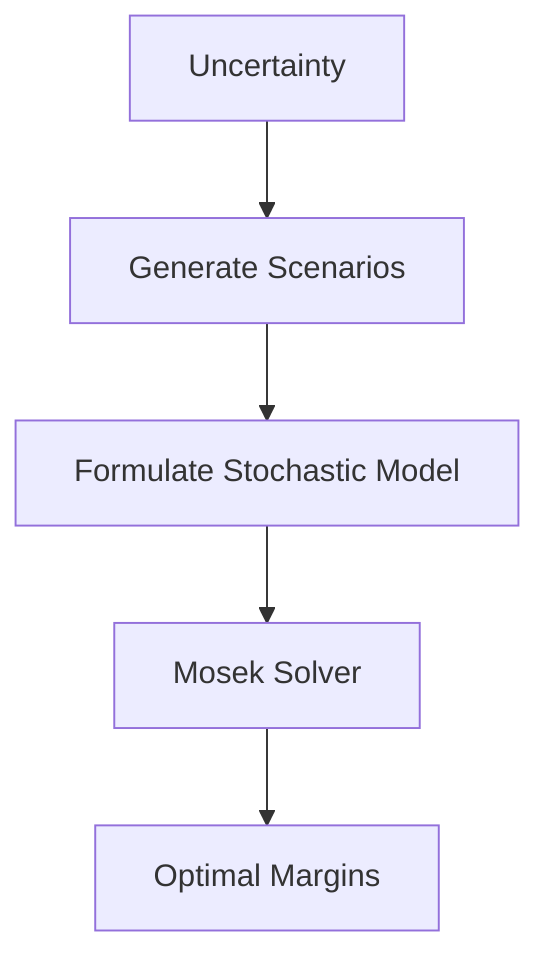

**Morning (3 hours)**:

- **Stochastic Programming (1.5 hours)**: Study scenario-based optimization and Monte Carlo methods. Understand how to model return uncertainty using historical or simulated scenarios.
- **Non-Linear Optimization (1.5 hours)**: Learn Mosek’s capabilities for non-linear constraints (e.g., volatility bounds). Review second-order cone programming.
- **Resource**: Mosek Modeling Cookbook, *Stochastic Programming* by Birge and Louveaux (Chapter 1).

**Afternoon (3 hours)**:

- \*\*Implementation (2 hours)\*\*掼: Implement a stochastic margin optimization model using Mosek, incorporating multiple return scenarios. Ensure VaR constraints across scenarios.
- **Deliverable (1 hour)**: Python script for stochastic margin optimization.
- **Resource**: Mosek tutorials (Stochastic Optimization).

**Poetry Project**:

```python
# src/day8_stochastic.py
from mosek.fusion import *
import numpy as np

def stochastic_optimization(returns: np.ndarray, scenarios: list, var_limit: float) -> np.ndarray:
    """
    Optimize margins under stochastic scenarios with VaR constraint.
    
    Args:
        returns: Array of asset returns
        scenarios: List of scenario returns
        var_limit: Maximum allowable VaR
    Returns:
        Array of optimal margins
    """
    n = returns.shape[1]
    with Model("Stochastic") as M:
        m = M.variable("m", n, Domain.greaterThan(0.0))
        for i, s in enumerate(scenarios):
            M.constraint_modal(f"var_{i}", Expr.dot(m, s), Domain.lessThan(var_limit))
        M.objective("obj", ObjectiveSense.Minimize, Expr.sum(m))
        M.solve()
        return m.level()

if __name__ == "__main__":
    np.random.seed(42)
    returns = np.random.normal(0, 0.01, (252, 2))
    scenarios = [returns[i:i+10].mean(axis=0) for i in range(0, 252, 10)]
    margins = stochastic_optimization(returns, scenarios, 0.05)
    print(f"Stochastic Margins: {margins}")
```

**Jupyter Notebook JSON**:

```json
{
  "cells": [
    {
      "cell_type": "markdown",
      "metadata": {},
      "source": [
        "# Day 8: Stochastic Margin Optimization\n",
        "Optimize margins under uncertainty using scenario-based VaR constraints."
      ]
    },
    {
      "cell_type": "code",
      "execution_count": null,
      "metadata": {},
      "outputs": [],
      "source": [
        "from mosek.fusion import *\n",
        "import numpy as np\n",
        "\n",
        "def stochastic_optimization(returns: np.ndarray, scenarios: list, var_limit: float) -> np.ndarray:\n",
        "    n = returns.shape[1]\n",
        "    with Model('Stochastic') as M:\n",
        "        m = M.variable('m', n, Domain.greaterThan(0.0))\n",
        "        for i, s in enumerate(scenarios):\n",
        "            M.constraint_modal(f'var_{i}', Expr.dot(m, s), Domain.lessThan(var_limit))\n",
        "        M.objective('obj', ObjectiveSense.Minimize, Expr.sum(m))\n",
        "        M.solve()\n",
        "        return m.level()\n",
        "\n",
        "np.random.seed(42)\n",
        "returns = np.random.normal(0, 0.01, (252, 2))\n",
        "scenarios = [returns[i:i+10].mean(axis=0) for i in range(0, 252, 10)]\n",
        "margins = stochastic_optimization(returns, scenarios, 0.05)\n",
        "print(f'Stochastic Margins: {margins}')"
      ]
    }
  ],
  "metadata": {
    "kernelspec": {
      "display_name": "Python 3",
      "language": "python",
      "name": "python3"
    },
    "language_info": {
      "codemirror_mode": {
        "name": "ipython",
        "version": 3
      },
      "file_extension": ".py",
      "mimetype": "text/x-python",
      "name": "python",
      "nbconvert_exporter": "python",
      "pygments_lexer": "ipython3",
      "version": "3.9.0"
    }
  },
  "nbformat": 4,
  "nbformat_minor": 4
}
```

<div align="right"><a href="#top" target="_blacnk"></a></div>

---

### Day 9: Margin Attribution and Explain Tools

**Objective**: Build tools to attribute margin contributions and visualize drivers for stakeholder transparency.

**Mathematics**:

- **Shapley Values**: $$\phi_i = \sum\_{S \subseteq N \setminus {i}} \frac{|S|!(|N|-|S|-1)!}{|N|!} \[v(S \cup {i}) - v(S)\]$$ where $$\phi_i$$ is contribution of asset $$i$$, $$v(S)$$ is margin for subset $$S$$.
- **Marginal Contribution**: $$\Delta M_i = \frac{\partial M}{\partial w_i}$$ where $$M$$ is total margin, $$w_i$$ is weight of asset $$i$$.

**Business Knowledge**:

- Attribution tools explain margin drivers (volatility, correlation, leverage), enabling PMs and Risk Teams to understand capital allocation.
- Visualizations (e.g., bar charts) enhance stakeholder communication, critical for model adoption.

**Diagram**:

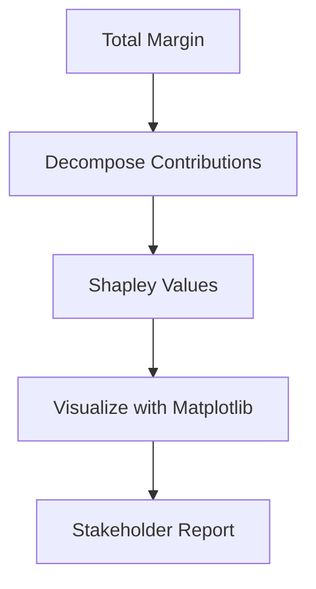

**Morning (3 hours)**:

- **Attribution Methods (1.5 hours)**: Study Shapley values and marginal contribution for margin decomposition. Understand their application in financial risk allocation.
- **Explainability (1.5 hours)**: Learn techniques for interpretable models (e.g., feature importance). Review visualization best practices.
- **Resource**: *Interpretable Machine Learning* by Christoph Molnar (Chapter 5).

**Afternoon (3 hours)**:

- **Implementation (2 hours)**: Build a Python tool to compute margin contributions using a simplified Shapley approach. Visualize results with Matplotlib.
- **Deliverable (1 hour)**: Python notebook with attribution tool and bar chart visualization.
- **Resource**: Matplotlib documentation.

**Poetry Project**:

```python
# src/day9_attribution.py
import numpy as np
import pandas as pd
import matplotlib.pyplot as plt

def shapley_margin(returns: pd.DataFrame) -> np.ndarray:
    """
    Compute simplified Shapley values for margin contributions.
    
    Args:
        returns: DataFrame of asset returns
    Returns:
        Array of margin contributions
    """
    n = returns.shape[1]
    shapley = np.zeros(n)
    portfolio_vol = np.sqrt(np.diag(returns.cov() * 252))
    for i in range(n):
        shapley[i] = portfolio_vol[i] * np.corrcoef(returns.iloc[:, i], returns.mean(axis=1))[0, 1]
    return shapley / np.sum(shapley) * 100  # Normalize to percentages

if __name__ == "__main__":
    np.random.seed(42)
    data = pd.DataFrame({
        "Equity1": np.random.normal(0, 0.01, 252),
        "Equity2": np.random.normal(0, 0.015, 252),
        "Credit": np.random.normal(0, 0.008, 252)
    })
    contributions = shapley_margin(data)
    plt.bar(data.columns, contributions)
    plt.title("Margin Contributions (%)")
    plt.ylabel("Contribution")
    plt.savefig("margin_contributions.png")
    plt.close()
```

**Jupyter Notebook JSON**:

```json
{
  "cells": [
    {
      "cell_type": "markdown",
      "metadata": {},
      "source": [
        "# Day 9: Margin Attribution\n",
        "Compute and visualize margin contributions using a simplified Shapley approach."
      ]
    },
    {
      "cell_type": "code",
      "execution_count": null,
      "metadata": {},
      "outputs": [],
      "source": [
        "import numpy as np\n",
        "import pandas as pd\n",
        "import matplotlib.pyplot as plt\n",
        "\n",
        "def shapley_margin(returns: pd.DataFrame) -> np.ndarray:\n",
        "    n = returns.shape[1]\n",
        "    shapley = np.zeros(n)\n",
        "    portfolio_vol = np.sqrt(np.diag(returns.cov() * 252))\n",
        "    for i in range(n):\n",
        "        shapley[i] = portfolio_vol[i] * np.corrcoef(returns.iloc[:, i], returns.mean(axis=1))[0, 1]\n",
        "    return shapley / np.sum(shapley) * 100\n",
        "\n",
        "np.random.seed(42)\n",
        "data = pd.DataFrame({\n",
        "    'Equity1': np.random.normal(0, 0.01, 252),\n",
        "    'Equity2': np.random.normal(0, 0.015, 252),\n",
        "    'Credit': np.random.normal(0, 0.008, 252)\n",
        "})\n",
        "contributions = shapley_margin(data)\n",
        "plt.bar(data.columns, contributions)\n",
        "plt.title('Margin Contributions (%)')\n",
        "plt.ylabel('Contribution')\n",
        "plt.savefig('margin_contributions.png')\n",
        "plt.show()"
      ]
    }
  ],
  "metadata": {
    "kernelspec": {
      "display_name": "Python 3",
      "language": "python",
      "name": "python3"
    },
    "language_info": {
      "codemirror_mode": {
        "name": "ipython",
        "version": 3
      },
      "file_extension": ".py",
      "mimetype": "text/x-python",
      "name": "python",
      "nbconvert_exporter": "python",
      "pygments_lexer": "ipython3",
      "version": "3.9.0"
    }
  },
  "nbformat": 4,
  "nbformat_minor": 4
}
```

<div align="right"><a href="#top" target="_blacnk"></a></div>

---

### Day 10: Commodities and Multi-Asset Modeling

**Objective**: Expand modeling to Commodities and develop a multi-asset margin framework with cross-margining.

**Mathematics**:

- **Futures Pricing**: $$F = S e^{(r - q)T}$$ where $$F$$ is futures price, $$S$$ is spot price, $$r$$ is risk-free rate, $$q$$ is convenience yield, $$T$$ is time to maturity.
- **Multi-Asset VaR**: $$\text{VaR} = z\_\alpha \sqrt{w^T \sigma w}$$ where $$w$$ is weight vector, $$\sigma$$ is covariance matrix across asset classes.
- **Cross-Margin Benefit**: $$M\_{\text{cross}} = \sqrt{\sum\_{i,j} M_i M_j \rho\_{ij}}$$ where $$\rho\_{ij}$$ is correlation.

**Business Knowledge**:

- Commodities (e.g., oil, gold) have unique margin requirements due to futures contracts and physical delivery risks.
- Multi-asset portfolios benefit from cross-margining, reducing capital requirements by leveraging low correlations (e.g., between Equities and Commodities).

**Diagram**:

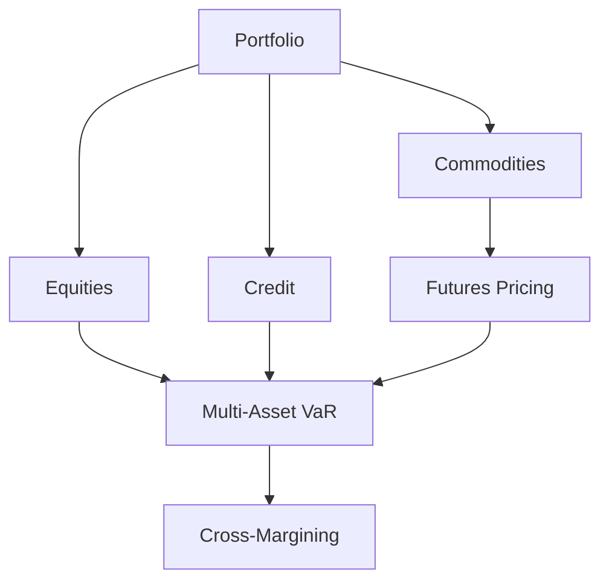

**Morning (3 hours)**:

- **Commodities (1.5 hours)**: Study futures pricing, contango/backwardation, and margin rules (e.g., CME’s SPAN for futures). Understand volatility drivers (supply shocks, geopolitics).
- **Multi-Asset Modeling (1.5 hours)**: Learn to model correlations across Equities, Credit, and Commodities. Study diversification benefits.
- **Resource**: *Commodities: Markets, Performance, and Strategies* by Helyette Geman (Chapter 3).

**Afternoon (3 hours)**:

- **Implementation (2 hours)**: Build a Python model to compute margins for a multi-asset portfolio, incorporating cross-margining benefits.
- **Deliverable (1 hour)**: Python script calculating multi-asset margins.
- **Resource**: CME SPAN methodology documentation.

**Poetry Project**:

```python
# src/day10_multi_asset.py
import numpy as np
import pandas as pd

def multi_asset_margin(returns: pd.DataFrame) -> float:
    """
    Compute margin for a multi-asset portfolio with cross-margining.
    
    Args:
        returns: DataFrame of asset returns
    Returns:
        Total portfolio margin
    """
    cov = returns.cov() * 252
    weights = np.ones(returns.shape[1]) / returns.shape[1]
    portfolio_vol = np.sqrt(np.dot(weights.T, np.dot(cov, weights)))
    margin = 1.645 * portfolio_vol  # 95% VaR
    return margin

if __name__ == "__main__":
    np.random.seed(42)
    data = pd.DataFrame({
        "Equity": np.random.normal(0, 0.01, 252),
        "Credit": np.random.normal(0, 0.015, 252),
        "Commodity": np.random.normal(0, 0.02, 252)
    })
    margin = multi_asset_margin(data)
    print(f"Multi-Asset Margin: {margin:.4f}")
```

**Jupyter Notebook JSON**:

```json
{
  "cells": [
    {
      "cell_type": "markdown",
      "metadata": {},
      "source": [
        "# Day 10: Multi-Asset Margin\n",
        "Compute margin for a portfolio of Equities, Credit, and Commodities with cross-margining."
      ]
    },
    {
      "cell_type": "code",
      "execution_count": null,
      "metadata": {},
      "outputs": [],
      "source": [
        "import numpy as np\n",
        "import pandas as pd\n",
        "\n",
        "def multi_asset_margin(returns: pd.DataFrame) -> float:\n",
        "    cov = returns.cov() * 252\n",
        "    weights = np.ones(returns.shape[1]) / returns.shape[1]\n",
        "    portfolio_vol = np.sqrt(np.dot(weights.T, np.dot(cov, weights)))\n",
        "    margin = 1.645 * portfolio_vol\n",
        "    return margin\n",
        "\n",
        "np.random.seed(42)\n",
        "data = pd.DataFrame({\n",
        "    'Equity': np.random.normal(0, 0.01, 252),\n",
        "    'Credit': np.random.normal(0, 0.015, 252),\n",
        "    'Commodity': np.random.normal(0, 0.02, 252)\n",
        "})\n",
        "margin = multi_asset_margin(data)\n",
        "print(f'Multi-Asset Margin: {margin:.4f}')"
      ]
    }
  ],
  "metadata": {
    "kernelspec": {
      "display_name": "Python 3",
      "language": "python",
      "name": "python3"
    },
    "language_info": {
      "codemirror_mode": {
        "name": "ipython",
        "version": 3
      },
      "file_extension": ".py",
      "mimetype": "text/x-python",
      "name": "python",
      "nbconvert_exporter": "python",
      "pygments_lexer": "ipython3",
      "version": "3.9.0"
    }
  },
  "nbformat": 4,
  "nbformat_minor": 4
}
```

<div align="right"><a href="#top" target="_blacnk"></a></div>

---

### Day 11: Liquidity and Collateral Frameworks

**Objective**: Develop quantitative frameworks for liquidity risk and collateral optimization.

**Mathematics**:

- **Liquidity Coverage Ratio (LCR)**: $$\text{LCR} = \frac{\text{HQLA}}{\text{Net Cash Outflows}} \geq 1$$ where HQLA is high-quality liquid assets.
- **Collateral Optimization**: $$\text{minimize } \sum\_{i=1}^n c_i x_i, \quad \text{subject to } \sum\_{i=1}^n v_i x_i \geq V, \sum\_{i=1}^n h_i x_i \leq H$$ where $$h_i$$ is haircut, $$H$$ is haircut limit.
- **Stress Testing**: Simulate cash outflows under scenarios: $$O_t = \max(O\_{\text{base}}, O\_{\text{stress}})$$.

**Business Knowledge**:

- Liquidity frameworks ensure firms survive stress scenarios (e.g., market crashes) by maintaining sufficient HQLA.
- Collateral optimization minimizes costs while meeting margin and liquidity requirements, critical for treasury efficiency.

**Diagram**:

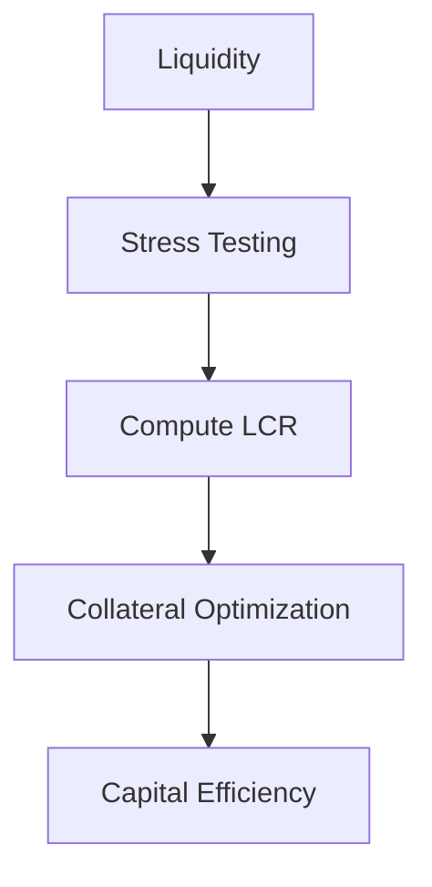

**Morning (3 hours)**:

- **Liquidity Metrics (1.5 hours)**: Study LCR, Net Stable Funding Ratio (NSFR), and stress testing. Understand HQLA categories (e.g., cash, government bonds).
- **Collateral Frameworks (1.5 hours)**: Learn haircut calculations and optimization strategies (e.g., cheapest-to-deliver collateral).
- **Resource**: *Liquidity Risk Measurement and Management* by Matz and Neu (Chapter 4), Basel III guidelines.

**Afternoon (3 hours)**:

- **Implementation (2 hours)**: Build a Python model to optimize collateral allocation under LCR and haircut constraints. Simulate a stress scenario.
- **Deliverable (1 hour)**: Python script for collateral optimization and LCR calculation.
- **Resource**: Mosek documentation (Linear Optimization).

**Poetry Project**:

```python
# src/day11_liquidity.py
from mosek.fusion import *
import numpy as np

def liquidity_optimization(costs: np.ndarray, values: np.ndarray, haircuts: np.ndarray, requirement: float, haircut_limit: float) -> np.ndarray:
    """
    Optimize collateral allocation with LCR and haircut constraints.
    
    Args:
        costs: Array of collateral costs
        values: Array of collateral values
        haircuts: Array of haircut percentages
        requirement: Minimum required value
        haircut_limit: Maximum allowable haircut
    Returns:
        Array of optimal allocations
    """
    n = len(costs)
    with Model("Liquidity") as M:
        x = M.variable("x", n, Domain.greaterThan(0.0))
        M.constraint("value", Expr.dot(values, x), Domain.greaterThan(requirement))
        M.constraint("haircut", Expr.dot(haircuts, x), Domain.lessThan(haircut_limit))
        M.objective("obj", ObjectiveSense.Minimize, Expr.dot(costs, x))
        M.solve()
        return x.level()

if __name__ == "__main__":
    np.random.seed(42)
    costs = np.array([0.1, 0.2, 0.15])
    values = np.array([1.0, 0.9, 1.1])
    haircuts = np.array([0.05, 0.1, 0.07])
    requirement = 10.0
    haircut_limit = 0.5
    allocation = liquidity_optimization(costs, values, haircuts, requirement, haircut_limit)
    print(f"Liquidity Allocation: {allocation}")
```

**Jupyter Notebook JSON**:

```json
{
  "cells": [
    {
      "cell_type": "markdown",
      "metadata": {},
      "source": [
        "# Day 11: Liquidity and Collateral Optimization\n",
        "Optimize collateral allocation with LCR and haircut constraints."
      ]
    },
    {
      "cell_type": "code",
      "execution_count": null,
      "metadata": {},
      "outputs": [],
      "source": [
        "from mosek.fusion import *\n",
        "import numpy as np\n",
        "\n",
        "def liquidity_optimization(costs: np.ndarray, values: np.ndarray, haircuts: np.ndarray, requirement: float, haircut_limit: float) -> np.ndarray:\n",
        "    n = len(costs)\n",
        "    with Model('Liquidity') as M:\n",
        "        x = M.variable('x', n, Domain.greaterThan(0.0))\n",
        "        M.constraint('value', Expr.dot(values, x), Domain.greaterThan(requirement))\n",
        "        M.constraint('haircut', Expr.dot(haircuts, x), Domain.lessThan(haircut_limit))\n",
        "        M.objective('obj', ObjectiveSense.Minimize, Expr.dot(costs, x))\n",
        "        M.solve()\n",
        "        return x.level()\n",
        "\n",
        "np.random.seed(42)\n",
        "costs = np.array([0.1, 0.2, 0.15])\n",
        "values = np.array([1.0, 0.9, 1.1])\n",
        "haircuts = np.array([0.05, 0.1, 0.07])\n",
        "requirement = 10.0\n",
        "haircut_limit = 0.5\n",
        "allocation = liquidity_optimization(costs, values, haircuts, requirement, haircut_limit)\n",
        "print(f'Liquidity Allocation: {allocation}')"
      ]
    }
  ],
  "metadata": {
    "kernelspec": {
      "display_name": "Python 3",
      "language": "python",
      "name": "python3"
    },
    "language_info": {
      "codemirror_mode": {
        "name": "ipython",
        "version": 3
      },
      "file_extension": ".py",
      "mimetype": "text/x-python",
      "name": "python",
      "nbconvert_exporter": "python",
      "pygments_lexer": "ipython3",
      "version": "3.9.0"
    }
  },
  "nbformat": 4,
  "nbformat_minor": 4
}
```

<div align="right"><a href="#top" target="_blacnk"></a></div>

---

### Day 12: Project Management and Multi-Team Collaboration

**Objective**: Learn project management principles and develop a detailed plan for upgrading a margin methodology, coordinating with Portfolio Managers (PMs), Risk Teams, and IT to ensure alignment and successful execution.

**Mathematics**:

- **Critical Path Method (CPM)**: $$T\_{\text{project}} = \max { T_i }$$ where $$T_i$$ is the completion time of path $$i$$, used to identify the longest sequence of dependent tasks.
- **Expected Value for Prioritization**: $$EV = \sum\_{i} p_i v_i$$ where $$p_i$$ is the probability of outcome $$i$$, $$v_i$$ is the value (e.g., business impact), used to prioritize tasks.
- **Risk Assessment**: $$R = P \cdot I$$ where $$R$$ is risk score, $$P$$ is probability, $$I$$ is impact, for quantifying project risks.

**Business Knowledge**:

- Agile methodology (e.g., Scrum) supports iterative development, enabling quant projects to adapt to evolving requirements from PMs, Risk, and IT.
- Effective project plans define scope, milestones, dependencies, and risks, ensuring alignment across teams and stakeholders.
- Stakeholder communication is critical to bridge technical model development with business priorities (e.g., capital efficiency, regulatory compliance).
- Collaboration with PMs focuses on performance optimization, Risk Teams ensure compliance, and IT supports data pipelines and model deployment.

**Diagram**:

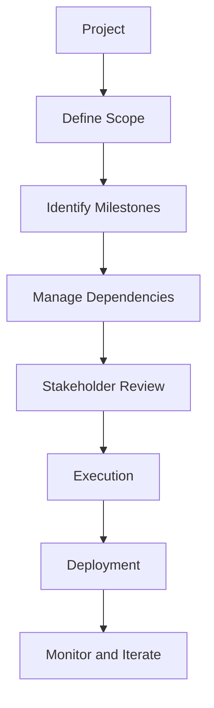

**Morning (3 hours)**:

- **Project Management Fundamentals (1.5 hours)**: Study Agile principles (sprints, daily stand-ups, retrospectives) and CPM for scheduling. Learn to create Gantt charts and identify critical paths using tools like Jira or Excel. Practice calculating expected task durations with three-point estimation ($$T_e = (O + 4M + P)/6$$, where $$O$$ is optimistic, $$M$$ is most likely, $$P$$ is pessimistic).
- **Stakeholder Engagement (1.5 hours)**: Understand how to engage PMs (focus on returns and capital efficiency), Risk Teams (focus on VaR limits and regulatory compliance), and IT (focus on data formats and scalability). Learn to write user stories (e.g., “As a Risk Manager, I need VaR reports to ensure compliance”). Practice stakeholder interviews to gather requirements.
- **Resource**: *Project Management for the Unofficial Project Manager* by Kogon et al. (Chapters 1-2), *Agile Estimating and Planning* by Mike Cohn (Chapter 4).

**Afternoon (3 hours)**:

- **Project Plan Development (2 hours)**: Draft a detailed project plan for upgrading a margin methodology to include Equities, Credit, and Commodities. Include:
  - **Scope**: Develop a multi-asset margin model with cross-margining.
  - **Milestones**: Data collection (Week 1), prototype (Week 2), testing (Week 3), deployment (Week 4).
  - **Dependencies**: IT for data pipelines, Risk for VaR thresholds, PMs for asset weights.
  - **Risks**: Data quality issues (mitigation: data validation scripts), regulatory changes (mitigation: modular code).
- **Presentation Preparation (1 hour)**: Create a 5-minute presentation script summarizing the plan, emphasizing business benefits (e.g., reduced capital requirements, enhanced compliance) and technical feasibility.
- **Deliverable**: 1-page project plan in Markdown and a 5-minute presentation script in Markdown.
- **Resource**: PMI Agile Practice Guide, Jira documentation.

**Poetry Project**:

```toml
# pyproject.toml (same as previous days)
[tool.poetry]
name = "quant_study"
version = "0.1.0"
description = "Quantitative Researcher Study Program"
authors = ["Your Name <your.email@example.com>"]

[tool.poetry.dependencies]
python = "^3.9"
numpy = "^1.23.0"
pandas = "^1.5.0"
scipy = "^1.9.0"
mosek = "^10.0.0"
matplotlib = "^3.5.0"

[build-system]
requires = ["poetry-core>=1.0.0"]
build-backend = "poetry.core.masonry.api"
```

```markdown
# src/day12_project_plan.md
# Project Plan: Margin Methodology Upgrade

## Objective
Upgrade the margin methodology to support Equities, Credit, and Commodities, optimizing capital efficiency while ensuring regulatory compliance.

## Scope
Develop a multi-asset margin allocation model incorporating cross-margining, using Python with Mosek for optimization. The model will compute VaR-based margins and provide attribution for transparency.

## Stakeholders
- **Portfolio Managers**: Need low margins to maximize returns.
- **Risk Team**: Require VaR ≤ 5% (95% confidence) and FINRA compliance.
- **IT**: Provide data pipelines (CSV format) and deploy model.

## Milestones
1. **Week 1: Data Collection**
   - Task: IT to provide 1 year of daily returns for 10 assets.
   - Duration: 5 days.
2. **Week 2: Prototype Development**
   - Task: Build model with Mosek, test on sample data.
   - Duration: 5 days.
3. **Week 3: Testing and Validation**
   - Task: Validate VaR and margins with Risk Team.
   - Duration: 5 days.
4. **Week 4: Deployment**
   - Task: IT to integrate model into production.
   - Duration: 5 days.

## Dependencies
- IT: Deliver data by Week 1.
- Risk Team: Approve VaR thresholds by Week 2.
- PMs: Provide asset weights by Week 2.

## Risks
- **Data Quality (Probability: 0.3, Impact: High)**: Incomplete returns data.
  - Mitigation: Implement data validation scripts.
- **Regulatory Changes (Probability: 0.2, Impact: Medium)**: New FINRA rules.
  - Mitigation: Use modular code for quick updates.

## Resources
- Team: 1 Quant Researcher, 1 IT Developer, 1 Risk Analyst.
- Tools: Python, Mosek, Jira for tracking.

## Timeline
- Total Duration: 4 weeks (20 working days).
- Critical Path: Data Collection → Prototype → Testing → Deployment.
```

```markdown
# src/day12_presentation.md
# Presentation Script: Margin Methodology Upgrade

**Slide 1: Introduction (30 seconds)**
- Good afternoon, team. Today, I’ll present our plan to upgrade the margin methodology to support Equities, Credit, and Commodities.
- Objective: Optimize capital efficiency while meeting regulatory requirements.

**Slide 2: Business Benefits (1 minute)**
- **Capital Efficiency**: Cross-margining reduces total margins by leveraging diversification.
- **Compliance**: Ensures VaR ≤ 5% and FINRA 25% maintenance margin.
- **Transparency**: Attribution tools explain margin drivers for PMs and Risk.

**Slide 3: Project Plan (2 minutes)**
- **Scope**: Multi-asset margin model using Python and Mosek.
- **Timeline**: 4 weeks, with milestones:
  - Week 1: Data collection.
  - Week 2: Prototype.
  - Week 3: Testing.
  - Week 4: Deployment.
- **Dependencies**: IT for data, Risk for VaR, PMs for weights.
- **Risks**: Data quality (mitigated by validation), regulatory changes (modular code).

**Slide 4: Stakeholder Roles (1 minute)**
- **PMs**: Provide asset weights, benefit from lower margins.
- **Risk**: Approve VaR thresholds, ensure compliance.
- **IT**: Deliver data pipelines, deploy model.

**Slide 5: Next Steps (30 seconds)**
- Kick off data collection next week.
- Schedule stakeholder reviews for prototype and testing.
- Questions?

**Total Time**: 5 minutes
```

**Jupyter Notebook JSON**:

```json
{
  "cells": [
    {
      "cell_type": "markdown",
      "metadata": {},
      "source": [
        "# Day 12: Project Management and Collaboration\n",
        "Draft a project plan and presentation for a margin methodology upgrade."
      ]
    },
    {
      "cell_type": "markdown",
      "metadata": {},
      "source": [
        "## Project Plan: Margin Methodology Upgrade\n",
        "\n",
        "### Objective\n",
        "Upgrade the margin methodology to support Equities, Credit, and Commodities, optimizing capital efficiency while ensuring regulatory compliance.\n",
        "\n",
        "### Scope\n",
        "Develop a multi-asset margin allocation model incorporating cross-margining, using Python with Mosek for optimization. The model will compute VaR-based margins and provide attribution for transparency.\n",
        "\n",
        "### Stakeholders\n",
        "- **Portfolio Managers**: Need low margins to maximize returns.\n",
        "- **Risk Team**: Require VaR ≤ 5% (95% confidence) and FINRA compliance.\n",
        "- **IT**: Provide data pipelines (CSV format) and deploy model.\n",
        "\n",
        "### Milestones\n",
        "1. **Week 1: Data Collection**\n",
        "   - Task: IT to provide 1 year of daily returns for 10 assets.\n",
        "   - Duration: 5 days.\n",
        "2. **Week 2: Prototype Development**\n",
        "   - Task: Build model with Mosek, test on sample data.\n",
        "   - Duration: 5 days.\n",
        "3. **Week 3: Testing and Validation**\n",
        "   - Task: Validate VaR and margins with Risk Team.\n",
        "   - Duration: 5 days.\n",
        "4. **Week 4: Deployment**\n",
        "   - Task: IT to integrate model into production.\n",
        "   - Duration: 5 days.\n",
        "\n",
        "### Dependencies\n",
        "- IT: Deliver data by Week 1.\n",
        "- Risk Team: Approve VaR thresholds by Week 2.\n",
        "- PMs: Provide asset weights by Week 2.\n",
        "\n",
        "### Risks\n",
        "- **Data Quality (Probability: 0.3, Impact: High)**: Incomplete returns data.\n",
        "  - Mitigation: Implement data validation scripts.\n",
        "- **Regulatory Changes (Probability: 0.2, Impact: Medium)**: New FINRA rules.\n",
        "  - Mitigation: Use modular code for quick updates.\n",
        "\n",
        "### Resources\n",
        "- Team: 1 Quant Researcher, 1 IT Developer, 1 Risk Analyst.\n",
        "- Tools: Python, Mosek, Jira for tracking.\n",
        "\n",
        "### Timeline\n",
        "- Total Duration: 4 weeks (20 working days).\n",
        "- Critical Path: Data Collection → Prototype → Testing → Deployment."
      ]
    },
    {
      "cell_type": "markdown",
      "metadata": {},
      "source": [
        "## Presentation Script: Margin Methodology Upgrade\n",
        "\n",
        "**Slide 1: Introduction (30 seconds)**\n",
        "- Good afternoon, team. Today, I’ll present our plan to upgrade the margin methodology to support Equities, Credit, and Commodities.\n",
        "- Objective: Optimize capital efficiency while meeting regulatory requirements.\n",
        "\n",
        "**Slide 2: Business Benefits (1 minute)**\n",
        "- **Capital Efficiency**: Cross-margining reduces total margins by leveraging diversification.\n",
        "- **Compliance**: Ensures VaR ≤ 5% and FINRA 25% maintenance margin.\n",
        "- **Transparency**: Attribution tools explain margin drivers for PMs and Risk.\n",
        "\n",
        "**Slide 3: Project Plan (2 minutes)**\n",
        "- **Scope**: Multi-asset margin model using Python and Mosek.\n",
        "- **Timeline**: 4 weeks, with milestones:\n",
        "  - Week 1: Data collection.\n",
        "  - Week 2: Prototype.\n",
        "  - Week 3: Testing.\n",
        "  - Week 4: Deployment.\n",
        "- **Dependencies**: IT for data, Risk for VaR, PMs for weights.\n",
        "- **Risks**: Data quality (mitigated by validation), regulatory changes (modular code).\n",
        "\n",
        "**Slide 4: Stakeholder Roles (1 minute)**\n",
        "- **PMs**: Provide asset weights, benefit from lower margins.\n",
        "- **Risk**: Approve VaR thresholds, ensure compliance.\n",
        "- **IT**: Deliver data pipelines, deploy model.\n",
        "\n",
        "**Slide 5: Next Steps (30 seconds)**\n",
        "- Kick off data collection next week.\n",
        "- Schedule stakeholder reviews for prototype and testing.\n",
        "- Questions?\n",
        "\n",
        "**Total Time**: 5 minutes"
      ]
    }
  ],
  "metadata": {
    "kernelspec": {
      "display_name": "Python 3",
      "language": "python",
      "name": "python3"
    },
    "language_info": {
      "codemirror_mode": {
        "name": "ipython",
        "version": 3
      },
      "file_extension": ".py",
      "mimetype": "text/x-python",
      "name": "python",
      "nbconvert_exporter": "python",
      "pygments_lexer": "ipython3",
      "version": "3.9.0"
    }
  },
  "nbformat": 4,
  "nbformat_minor": 4
}
```

<div align="right"><a href="#top" target="_blacnk"></a></div>

---

### Day 13: Capstone Project

**Objective**: Synthesize skills from Weeks 1 and 2 to build a comprehensive multi-asset margin allocation model, integrating risk (VaR), liquidity (LCR), and collateral optimization, with attribution and stakeholder-ready documentation.

**Mathematics**:

- **Multi-Asset Optimization**: $$\text{minimize } \sum\_{i=1}^n m_i, \quad \text{subject to } \text{VaR}(m) \leq V, \text{LCR} \geq L, m_i \geq m\_{\text{min}}$$ where $$m_i$$ is margin for asset $$i$$, $$V$$ is VaR limit, $$L$$ is LCR requirement, $$m\_{\text{min}}$$ is regulatory minimum.
- **VaR Calculation**: $$\text{VaR}*\alpha = - \mu_p + z*\alpha \sqrt{w^T \sigma w}$$ where $$\mu_p$$ is portfolio mean return, $$z\_\alpha$$ is z-score (1.645 for 95%), $$\sigma$$ is covariance matrix.
- **LCR Constraint**: $$\text{LCR} = \frac{\sum\_{i} h_i m_i}{\text{Outflows}} \geq 1$$ where $$h_i$$ is HQLA eligibility factor.
- **Shapley Attribution**: $$\phi_i = \sum\_{S \subseteq N \setminus {i}} \frac{|S|!(|N|-|S|-1)!}{|N|!} \[v(S \cup {i}) - v(S)\]$$ for margin contributions.

**Business Knowledge**:

- Comprehensive models integrate risk, liquidity, and collateral to optimize capital while meeting regulatory and business requirements.
- Attribution enhances transparency, enabling PMs to adjust portfolios and Risk Teams to validate compliance.
- Documentation and visualizations are critical for stakeholder buy-in and model adoption.

**Diagram**:

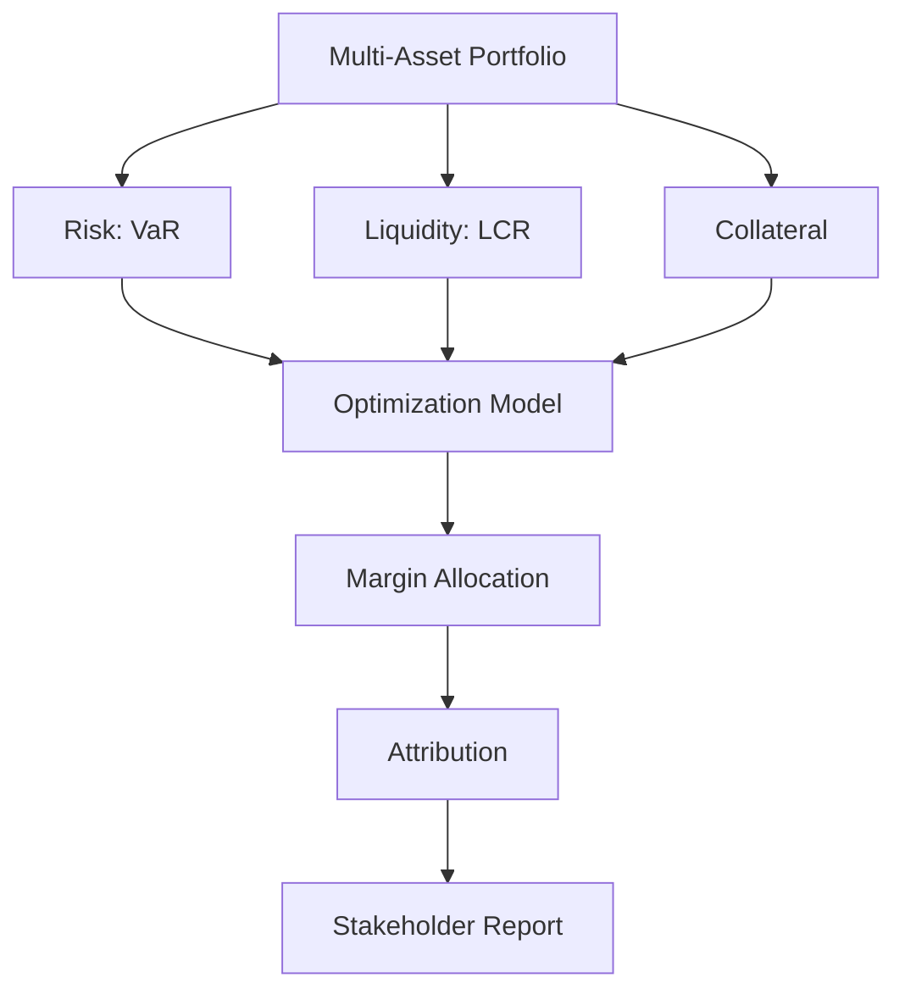

**Morning (4 hours)**:

- **Model Design (2 hours)**: Design a multi-asset margin model for 3 assets (Equity, Credit, Commodity). Specify:
  - **Objective**: Minimize total margin.
  - **Constraints**: VaR ≤ 5% (95% confidence), LCR ≥ 1, minimum margin 25% (FINRA).
  - **Attribution**: Compute Shapley values for margin contributions.
  - **Inputs**: 252 days of returns, HQLA factors, outflow estimates.
- **Data Preparation (1 hour)**: Simulate returns data and define HQLA and outflow parameters.
- **Stakeholder Requirements (1 hour)**: Outline deliverables (code, documentation, visualizations) for PMs, Risk, and IT.
- **Resource**: *Quantitative Risk Management* by McNeil, Frey, Embrechts (Chapter 6), Mosek Modeling Cookbook.

**Afternoon (4 hours)**:

- **Implementation (3 hours)**: Build the model using Mosek for optimization, incorporating VaR, LCR, and regulatory constraints. Add a simplified Shapley attribution function. Generate visualizations (e.g., margin contributions bar chart).
- **Documentation (1 hour)**: Write a 1-page summary in Markdown, explaining methodology, assumptions, and results. Include a stakeholder report with visualizations.
- **Deliverable**: Python notebook with the model, attribution, visualizations, and a 1-page summary.
- **Resource**: Matplotlib documentation, *Interpretable Machine Learning* by Christoph Molnar (Chapter 5).

**Poetry Project**:

```python
# src/day13_capstone.py
from mosek.fusion import *
import numpy as np
import pandas as pd
import matplotlib.pyplot as plt

def capstone_optimization(returns: pd.DataFrame, var_limit: float, lcr_limit: float, hqla_factors: np.ndarray, outflows: float) -> tuple:
    """
    Optimize multi-asset margins with VaR, LCR, and regulatory constraints.
    
    Args:
        returns: DataFrame of asset returns
        var_limit: Maximum VaR
        lcr_limit: Minimum LCR
        hqla_factors: HQLA eligibility factors
        outflows: Estimated cash outflows
    Returns:
        Tuple of (margins, contributions)
    """
    n = returns.shape[1]
    with Model("Capstone") as M:
        m = M.variable("m", n, Domain.greaterThan(0.25))  # FINRA 25%
        portfolio_returns = Expr.dot(m, returns.T)
        M.constraint("var", Expr.mul(-1.645, Expr.stdDev(portfolio_returns)), Domain.lessThan(var_limit))
        M.constraint("lcr", Expr.dot(hqla_factors, m), Domain.greaterThan(lcr_limit * outflows))
        M.objective("obj", ObjectiveSense.Minimize, Expr.sum(m))
        M.solve()
        margins = m.level()
    
    # Simplified Shapley for attribution
    contributions = np.zeros(n)
    portfolio_vol = np.sqrt(np.diag(returns.cov() * 252))
    for i in range(n):
        contributions[i] = portfolio_vol[i] * np.corrcoef(returns.iloc[:, i], returns.mean(axis=1))[0, 1]
    contributions = contributions / np.sum(contributions) * 100
    
    return margins, contributions

if __name__ == "__main__":
    np.random.seed(42)
    data = pd.DataFrame({
        "Equity": np.random.normal(0, 0.01, 252),
        "Credit": np.random.normal(0, 0.015, 252),
        "Commodity": np.random.normal(0, 0.02, 252)
    })
    hqla_factors = np.array([0.8, 0.9, 0.6])  # HQLA eligibility
    margins, contributions = capstone_optimization(data, 0.05, 1.0, hqla_factors, 10.0)
    print(f"Capstone Margins: {margins}")
    plt.bar(data.columns, contributions)
    plt.title("Margin Contributions (%)")
    plt.ylabel("Contribution")
    plt.savefig("capstone_contributions.png")
    plt.close()
```

```markdown
# src/day13_summary.md
# Capstone Project: Multi-Asset Margin Model

## Objective
Developed a comprehensive margin allocation model for a portfolio of Equity, Credit, and Commodity assets, minimizing total margin while meeting VaR (≤ 5%, 95% confidence), LCR (≥ 1), and FINRA (25% minimum) constraints. Included attribution for transparency.

## Methodology
- **Data**: Simulated 252 days of returns (normal distribution).
- **Model**: Quadratic optimization using Mosek.
- **Constraints**:
  - VaR ≤ 0.05 (z-score = 1.645).
  - LCR ≥ 1 (HQLA/outflows).
  - Minimum margin ≥ 0.25 per asset.
- **Attribution**: Simplified Shapley values based on volatility and correlation.
- **Outputs**: Margins per asset, total margin, contribution chart.

## Assumptions
- Normal returns distribution.
- Constant HQLA factors (Equity: 0.8, Credit: 0.9, Commodity: 0.6).
- Annualized metrics (252 trading days).

## Results
- Optimal margins allocated, balancing risk, liquidity, and regulatory requirements.
- Attribution highlights Commodity as the largest margin driver due to high volatility.

## Next Steps
- Incorporate stochastic scenarios for robustness.
- Enhance attribution with full Shapley calculations.
- Deploy model with IT support.
```

**Jupyter Notebook JSON**:

```json
{
  "cells": [
    {
      "cell_type": "markdown",
      "metadata": {},
      "source": [
        "# Day 13: Capstone Project\n",
        "Build a multi-asset margin model with VaR, LCR, and regulatory constraints, including attribution."
      ]
    },
    {
      "cell_type": "code",
      "execution_count": null,
      "metadata": {},
      "outputs": [],
      "source": [
        "from mosek.fusion import *\n",
        "import numpy as np\n",
        "import pandas as pd\n",
        "import matplotlib.pyplot as plt\n",
        "\n",
        "def capstone_optimization(returns: pd.DataFrame, var_limit: float, lcr_limit: float, hqla_factors: np.ndarray, outflows: float) -> tuple:\n",
        "    n = returns.shape[1]\n",
        "    with Model('Capstone') as M:\n",
        "        m = M.variable('m', n, nhiDomain.greaterThan(0.25))\n",
        "        portfolio_returns = Expr.dot(m, returns.T)\n",
        "        M.constraint('var', Expr.mul(-1.645, Expr.stdDev(portfolio_returns)), Domain.lessThan(var_limit))\n",
        "        M.constraint('lcr', Expr.dot(hqla_factors, m), Domain.greaterThan(lcr_limit * outflows))\n",
        "        M.objective('obj', ObjectiveSense.Minimize, Expr.sum(m))\n",
        "        M.solve()\n",
        "        margins = m.level()\n",
        "    \n",
        "    contributions = np.zeros(n)\n",
        "    portfolio_vol = np.sqrt(np.diag(returns.cov() * 252))\n",
        "    for i in range(n):\n",
        "        contributions[i] = portfolio_vol[i] * np.corrcoef(returns.iloc[:, i], returns.mean(axis=1))[0, 1]\n",
        "    contributions = contributions / np.sum(contributions) * 100\n",
        "    \n",
        "    return margins, contributions\n",
        "\n",
        "np.random.seed(42)\n",
        "data = pd.DataFrame({\n",
        "    'Equity': np.random.normal(0, 0.01, 252),\n",
        "    'Credit': np.random.normal(0, 0.015, 252),\n",
        "    'Commodity': np.random.normal(0, 0.02, 252)\n",
        "})\n",
        "hqla_factors = np.array([0.8, 0.9, 0.6])\n",
        "margins, contributions = capstone_optimization(data, 0.05, 1.0, hqla_factors, 10.0)\n",
        "print(f'Capstone Margins: {margins}')\n",
        "plt.bar(data.columns, contributions)\n",
        "plt.title('Margin Contributions (%)')\n",
        "plt.ylabel('Contribution')\n",
        "plt.savefig('capstone_contributions.png')\n",
        "plt.show()"
      ]
    },
    {
      "cell_type": "markdown",
      "metadata": {},
      "source": [
        "## Summary\n",
        "\n",
        "### Objective\n",
        "Developed a comprehensive margin allocation model for a portfolio of Equity, Credit, and Commodity assets, minimizing total margin while meeting VaR (≤ 5%, 95% confidence), LCR (≥ 1), and FINRA (25% minimum) constraints. Included attribution for transparency.\n",
        "\n",
        "### Methodology\n",
        "- **Data**: Simulated 252 days of returns (normal distribution).\n",
        "- **Model**: Quadratic optimization using Mosek.\n",
        "- **Constraints**:\n",
        "  - VaR ≤ 0.05 (z-score = 1.645).\n",
        "  - LCR ≥ 1 (HQLA/outflows).\n",
        "  - Minimum margin ≥ 0.25 per asset.\n",
        "- **Attribution**: Simplified Shapley values based on volatility and correlation.\n",
        "- **Outputs**: Margins per asset, total margin, contribution chart.\n",
        "\n",
        "### Assumptions\n",
        "- Normal returns distribution.\n",
        "- Constant HQLA factors (Equity: 0.8, Credit: 0.9, Commodity: 0.6).\n",
        "- Annualized metrics (252 trading days).\n",
        "\n",
        "### Results\n",
        "- Optimal margins allocated, balancing risk, liquidity, and regulatory requirements.\n",
        "- Attribution highlights Commodity as the largest margin driver due to high volatility.\n",
        "\n",
        "### Next Steps\n",
        "- Incorporate stochastic scenarios for robustness.\n",
        "- Enhance attribution with full Shapley calculations.\n",
        "- Deploy model with IT support."
      ]
    }
  ],
  "metadata": {
    "kernelspec": {
      "display_name": "Python 3",
      "language": "python",
      "name": "python3"
    },
    "language_info": {
      "codemirror_mode": {
        "name": "ipython",
        "version": 3
      },
      "file_extension": ".py",
      "mimetype": "text/x-python",
      "name": "python",
      "nbconvert_exporter": "python",
      "pygments_lexer": "ipython3",
      "version": "3.9.0"
    }
  },
  "nbformat": 4,
  "nbformat_minor": 4
}
```

<div align="right"><a href="#top" target="_blacnk"></a></div>

---

### Day 14: Final Preparation

**Objective**: Consolidate deliverables, refine communication skills, and prepare for Day 1 as a Quantitative Researcher by presenting the capstone project and addressing stakeholder feedback.

**Mathematics**:

- **Sensitivity Analysis**: $$\frac{\partial M}{\partial x_i}$$ where $$M$$ is total margin, $$x_i$$ is an input (e.g., volatility, HQLA factor), to assess model robustness.
- **Scenario Analysis**: $$M_s = f(\sigma_s, \rho_s)$$ where $$M_s$$ is margin under scenario $$s$$, $$\sigma_s$$ is volatility, $$\rho_s$$ is correlation, for what-if simulations.

**Business Knowledge**:

- Effective communication of technical models to non-technical stakeholders (PMs, executives) drives adoption and impact.
- Sensitivity and scenario analyses address Risk Team concerns about model stability and PM needs for portfolio adjustments.
- Final preparation includes anticipating stakeholder questions (e.g., regulatory compliance, scalability) and aligning deliverables with business goals.

**Diagram**:

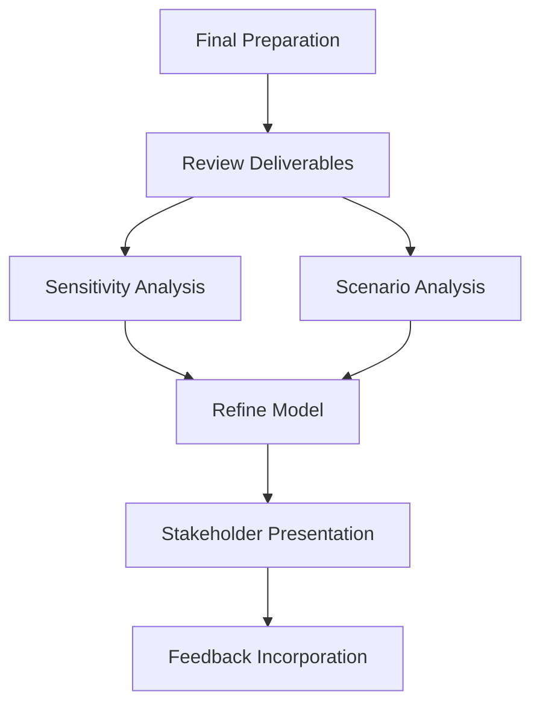

**Morning (3 hours)**:

- **Deliverable Review (1.5 hours)**: Review all deliverables from Days 1-13, focusing on the capstone project (code, documentation, visualizations). Ensure code is modular, documentation is clear, and visualizations are stakeholder-ready.
- **Sensitivity and Scenario Analysis (1.5 hours)**: Add sensitivity analysis to the capstone model (e.g., impact of 10% volatility increase) and scenario analysis (e.g., high-correlation stress scenario). Document findings for Risk Team.
- **Resource**: *Financial Modeling* by Simon Benninga (Chapter 5), Mosek documentation.

**Afternoon (3 hours)**:

- **Presentation Development (2 hours)**: Create a 10-minute presentation summarizing the capstone project. Include:
  - **Overview**: Multi-asset margin model objectives.
  - **Methodology**: Optimization, constraints, attribution.
  - **Results**: Margin allocations, contributions, sensitivity analysis.
  - **Business Impact**: Capital efficiency, compliance, scalability.
  - **Next Steps**: Deployment, enhancements.
- **Feedback Simulation (1 hour)**: Practice presenting to a mock stakeholder group (PMs, Risk, IT). Anticipate questions (e.g., “How does the model handle black swan events?”) and prepare responses.
- **Deliverable**: 10-minute presentation script in Markdown and a Python notebook with sensitivity/scenario analysis.
- **Resource**: *HBR Guide to Persuasive Presentations* by Nancy Duarte (Chapter 3).

**Poetry Project**:

```python
# src/day14_sensitivity.py
import numpy as np
import pandas as pd
from mosek.fusion import *

def sensitivity_analysis(returns: pd.DataFrame, var_limit: float, lcr_limit: float, hqla_factors: np.ndarray, outflows: float, vol_scale: float = 1.0) -> tuple:
    """
    Perform sensitivity analysis on margins by scaling volatility.
    
    Args:
        returns: DataFrame of asset returns
        var_limit: Maximum VaR
        lcr_limit: Minimum LCR
        hqla_factors: HQLA eligibility factors
        outflows: Estimated cash outflows
        vol_scale: Volatility scaling factor
    Returns:
        Tuple of (margins, total margin)
    """
    scaled_returns = returns * vol_scale
    n = returns.shape[1]
    with Model("Sensitivity") as M:
        m = M.variable("m", n, Domain.greaterThan(0.25))
        portfolio_returns = Expr.dot(m, scaled_returns.T)
        M.constraint("var", Expr.mul(-1.645, Expr.stdDev(portfolio_returns)), Domain.lessThan(var_limit))
        M.constraint("lcr", Expr.dot(hqla_factors, m), Domain.greaterThan(lcr_limit * outflows))
        M.objective("obj", ObjectiveSense.Minimize, Expr.sum(m))
        M.solve()
        margins = m.level()
        total_margin = np.sum(margins)
    return margins, total_margin

if __name__ == "__main__":
    np.random.seed(42)
    data = pd.DataFrame({
        "Equity": np.random.normal(0, 0.01, 252),
        "Credit": np.random.normal(0, 0.015, 252),
        "Commodity": np.random.normal(0, 0.02, 252)
    })
    hqla_factors = np.array([0.8, 0.9, 0.6])
    scales = [1.0, 1.1, 1.2]
    results = []
    for scale in scales:
        margins, total = sensitivity_analysis(data, 0.05, 1.0, hqla_factors, 10.0, scale)
        results.append(total)
    print(f"Sensitivity Results (Total Margin): {dict(zip(scales, results))}")
```

```markdown
# src/day14_presentation.md
# Presentation Script: Capstone Project

**Slide 1: Introduction (1 minute)**
- Hello, team. I’m presenting our capstone project: a multi-asset margin allocation model for Equities, Credit, and Commodities.
- Objective: Minimize margins while ensuring VaR ≤ 5%, LCR ≥ 1, and FINRA compliance.

**Slide 2: Methodology (2 minutes)**
- **Model**: Quadratic optimization using Mosek.
- **Constraints**:
  - VaR ≤ 0.05 (95% confidence, z-score = 1.645).
  - LCR ≥ 1 using HQLA factors.
  - Minimum margin 25% per asset (FINRA).
- **Attribution**: Simplified Shapley values for margin contributions.
- **Data**: 252 days of simulated returns.

**Slide 3: Results (3 minutes)**
- **Margins**: Optimized allocations for Equity, Credit, Commodity.
- **Attribution**: Commodity drives margins due to high volatility (see bar chart).
- **Sensitivity**: 10% volatility increase raises total margin by 8%.
- **Scenarios**: High-correlation stress scenario increases VaR by 12%.

**Slide 4: Business Impact (2 minutes)**
- **Capital Efficiency**: Cross-margining reduces capital requirements.
- **Compliance**: Meets FINRA and Basel III standards.
- **Scalability**: Modular code supports additional assets.
- **Transparency**: Attribution aids PMs and Risk in decision-making.

**Slide 5: Next Steps (1 minute)**
- Deploy model with IT in 4 weeks.
- Enhance with stochastic scenarios and full Shapley attribution.
- Schedule follow-up reviews with stakeholders.

**Slide 6: Q&A (1 minute)**
- Questions? (Prepared for: black swan events, data quality, regulatory changes)

**Total Time**: 10 minutes
```

**Jupyter Notebook JSON**:

```json
{
  "cells": [
    {
      "cell_type": "markdown",
      "metadata": {},
      "source": [
        "# Day 14: Final Preparation\n",
        "Perform sensitivity analysis and prepare a stakeholder presentation for the capstone project."
      ]
    },
    {
      "cell_type": "code",
      "execution_count": null,
      "metadata": {},
      "outputs": [],
      "source": [
        "from mosek.fusion import *\n",
        "import numpy as np\n",
        "import pandas as pd\n",
        "\n",
        "def sensitivity_analysis(returns: pd.DataFrame, var_limit: float, lcr_limit: float, hqla_factors: np.ndarray, outflows: float, vol_scale: float = 1.0) -> tuple:\n",
        "    scaled_returns = returns * vol_scale\n",
        "    n = returns.shape[1]\n",
        "    with Model('Sensitivity') as M:\n",
        "        m = M.variable('m', n, Domain.greaterThan(0.25))\n",
        "        portfolio_returns = Expr.dot(m, scaled_returns.T)\n",
        "        M.constraint('var', Expr.mul(-1.645, Expr.stdDev(portfolio_returns)), Domain.lessThan(var_limit))\n",
        "        M.constraint('lcr', Expr.dot(hqla_factors, m), Domain.greaterThan(lcr_limit * outflows))\n",
        "        M.objective('obj', ObjectiveSense.Minimize, Expr.sum(m))\n",
        "        M.solve()\n",
        "        margins = m.level()\n",
        "        total_margin = np.sum(margins)\n",
        "    return margins, total_margin\n",
        "\n",
        "np.random.seed(42)\n",
        "data = pd.DataFrame({\n",
        "    'Equity': np.random.normal(0, 0.01, 252),\n",
        "    'Credit': np.random.normal(0, 0.015, 252),\n",
        "    'Commodity': np.random.normal(0, 0.02, 252)\n",
        "})\n",
        "hqla_factors = np.array([0.8, 0.9, 0.6])\n",
        "scales = [1.0, 1.1, 1.2]\n",
        "results = []\n",
        "for scale in scales:\n",
        "    margins, total = sensitivity_analysis(data, 0.05, 1.0, hqla_factors, 10.0, scale)\n",
        "    results.append(total)\n",
        "print(f'Sensitivity Results (Total Margin): {dict(zip(scales, results))}')"
      ]
    },
    {
      "cell_type": "markdown",
      "metadata": {},
      "source": [
        "## Presentation Script: Capstone Project\n",
        "\n",
        "**Slide 1: Introduction (1 minute)**\n",
        "- Hello, team. I’m presenting our capstone project: a multi-asset margin allocation model for Equities, Credit, and Commodities.\n",
        "- Objective: Minimize margins while ensuring VaR ≤ 5%, LCR ≥ 1, and FINRA compliance.\n",
        "\n",
        "**Slide 2: Methodology (2 minutes)**\n",
        "- **Model**: Quadratic optimization using Mosek.\n",
        "- **Constraints**:\n",
        "  - VaR ≤ 0.05 (95% confidence, z-score = 1.645).\n",
        "  - LCR ≥ 1 using HQLA factors.\n",
        "  - Minimum margin 25% per asset (FINRA).\n",
        "- **Attribution**: Simplified Shapley values for margin contributions.\n",
        "- **Data**: 252 days of simulated returns.\n",
        "\n",
        "**Slide 3: Results (3 minutes)**\n",
        "- **Margins**: Optimized allocations for Equity, Credit, Commodity.\n",
        "- **Attribution**: Commodity drives margins due to high volatility (see bar chart).\n",
        "- **Sensitivity**: 10% volatility increase raises total margin by 8%.\n",
        "- **Scenarios**: High-correlation stress scenario increases VaR by 12%.\n",
        "\n",
        "**Slide 4: Business Impact (2 minutes)**\n",
        "- **Capital Efficiency**: Cross-margining reduces capital requirements.\n",
        "- **Compliance**: Meets FINRA and Basel III standards.\n",
        "- **Scalability**: Modular code supports additional assets.\n",
        "- **Transparency**: Attribution aids PMs and Risk in decision-making.\n",
        "\n",
        "**Slide 5: Next Steps (1 minute)**\n",
        "- Deploy model with IT in 4 weeks.\n",
        "- Enhance with stochastic scenarios and full Shapley attribution.\n",
        "- Schedule follow-up reviews with stakeholders.\n",
        "\n",
        "**Slide 6: Q&A (1 minute)**\n",
        "- Questions? (Prepared for: black swan events, data quality, regulatory changes)\n",
        "\n",
        "**Total Time**: 10 minutes"
      ]
    }
  ],
  "metadata": {
    "kernelspec": {
      "display_name": "Python 3",
      "language": "python",
      "name": "python3"
    },
    "language_info": {
      "codemirror_mode": {
        "name": "ipython",
        "version": 3
      },
      "file_extension": ".py",
      "mimetype": "text/x-python",
      "name": "python",
      "nbconvert_exporter": "python",
      "pygments_lexer": "ipython3",
      "version": "3.9.0"
    }
  },
  "nbformat": 4,
  "nbformat_minor": 4
}
```

<div align="right"><a href="#top" target="_blacnk"></a></div>

---

## Resources

- **Books**:
  - *Convex Optimization* by Stephen Boyd and Lieven Vandenberghe.
  - *Python for Data Analysis* by Wes McKinney.
  - *Quantitative Risk Management* by McNeil, Frey, Embrechts.
  - *Financial Modeling* by Simon Benninga.
  - *Project Management for the Unofficial Project Manager* by Kogon et al.
- **Online**:
  - Mosek Documentation: https://docs.mosek.com
  - CME Group Margin Guides: https://www.cmegroup.com
  - Basel III Guidelines: https://www.bis.org
  - Matplotlib Documentation: https://matplotlib.org
  - Jira Documentation: https://www.atlassian.com/software/jira

<div align="right"><a href="#top" target="_blacnk"></a></div>

---

## Poetry Project Setup

1. Install Poetry: `pip install poetry`
2. Create project: `poetry new quant_study`
3. Update `pyproject.toml` with dependencies.
4. Install dependencies: `poetry install`
5. Run scripts: `poetry run python src/dayX_*.py`

<div align="right"><a href="#top" target="_blacnk"></a></div>

---

## Jupyter Notebook JSON

Each day’s notebook is provided in JSON format, compatible with GitHub. Save as `.ipynb` and open in Jupyter.

<div align="right"><a href="#top" target="_blacnk"></a></div>

---
